HƯỚNG DẪN CHẠY TEST
1. Khởi động MongoDB và RabbitMQ
bash
# Trong thư mục booking-service
docker-compose up -d

# Kiểm tra containers
docker ps
2. Cài đặt dependencies
bash
npm install
3. Khởi động Mock Pricing Service (terminal 1)
bash
npm run mock-pricing
4. Khởi động Booking Service (terminal 2)
bash
npm run dev
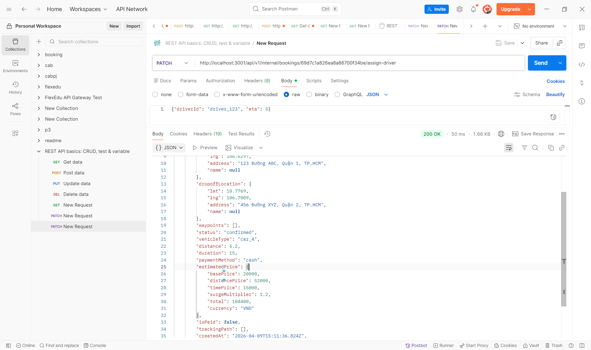
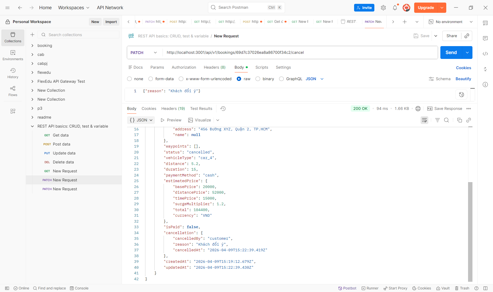
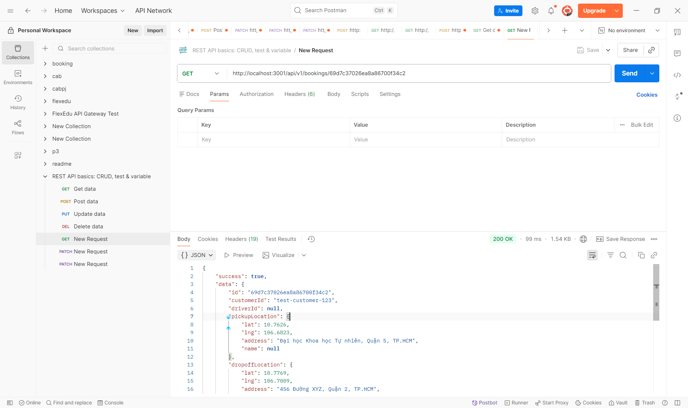
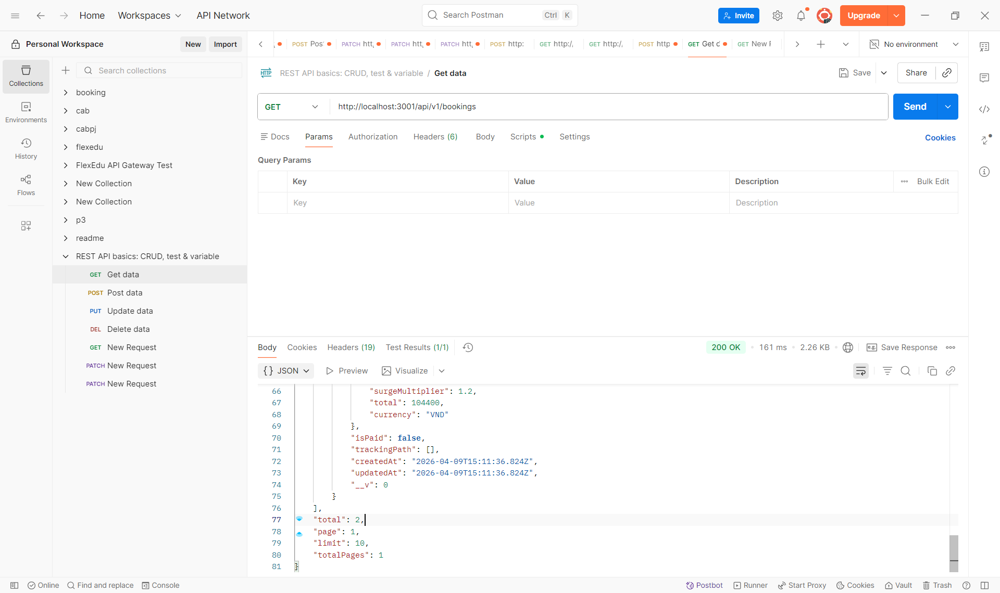
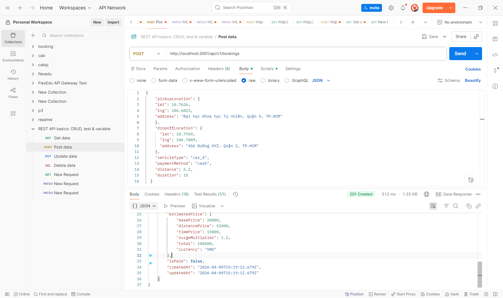
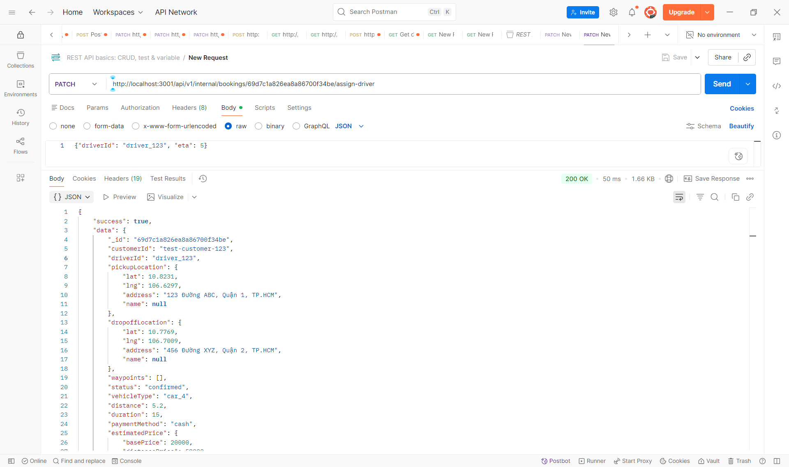
-------------
TC3
POST http://localhost:3000/api/bookings
{
  "pickupLocation": {
    "lat": 10.850587,
    "lng": 106.762776,
    "address": "123 Đường Test, Quận 1, TP HCM"
  },
  "dropoffLocation": {
    "lat": 10.835642,
    "lng": 106.658679,
    "address": "456 Đường Test, Quận 2, TP HCM"
  },
  "vehicleType": "car_4",
  "paymentMethod": "cash",
  "distance": 11.26,
  "duration": 23
}
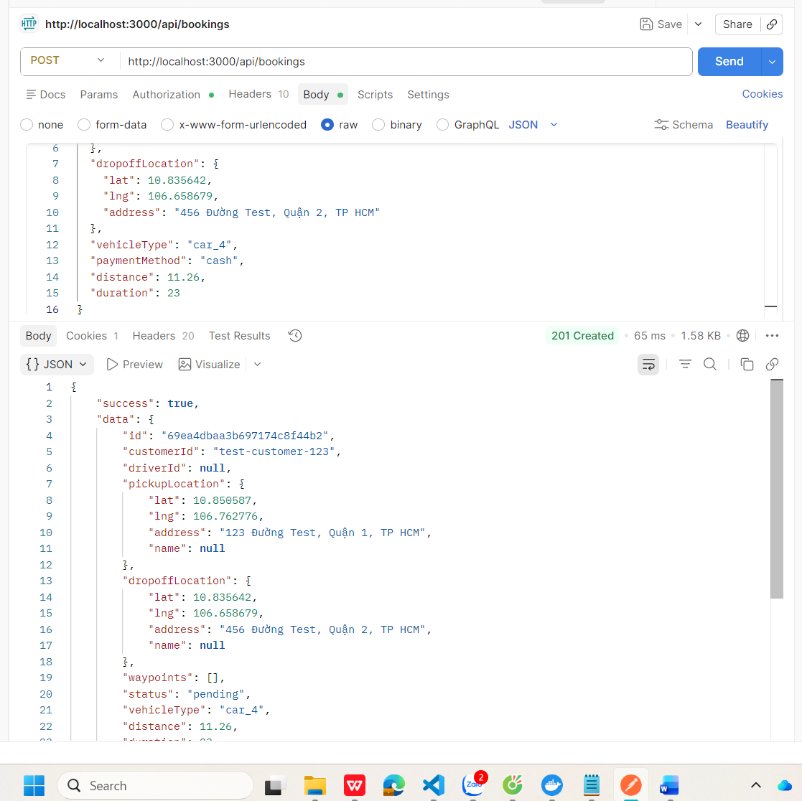

TC4
GET http://localhost:3000/api/bookings?page=1&limit=10
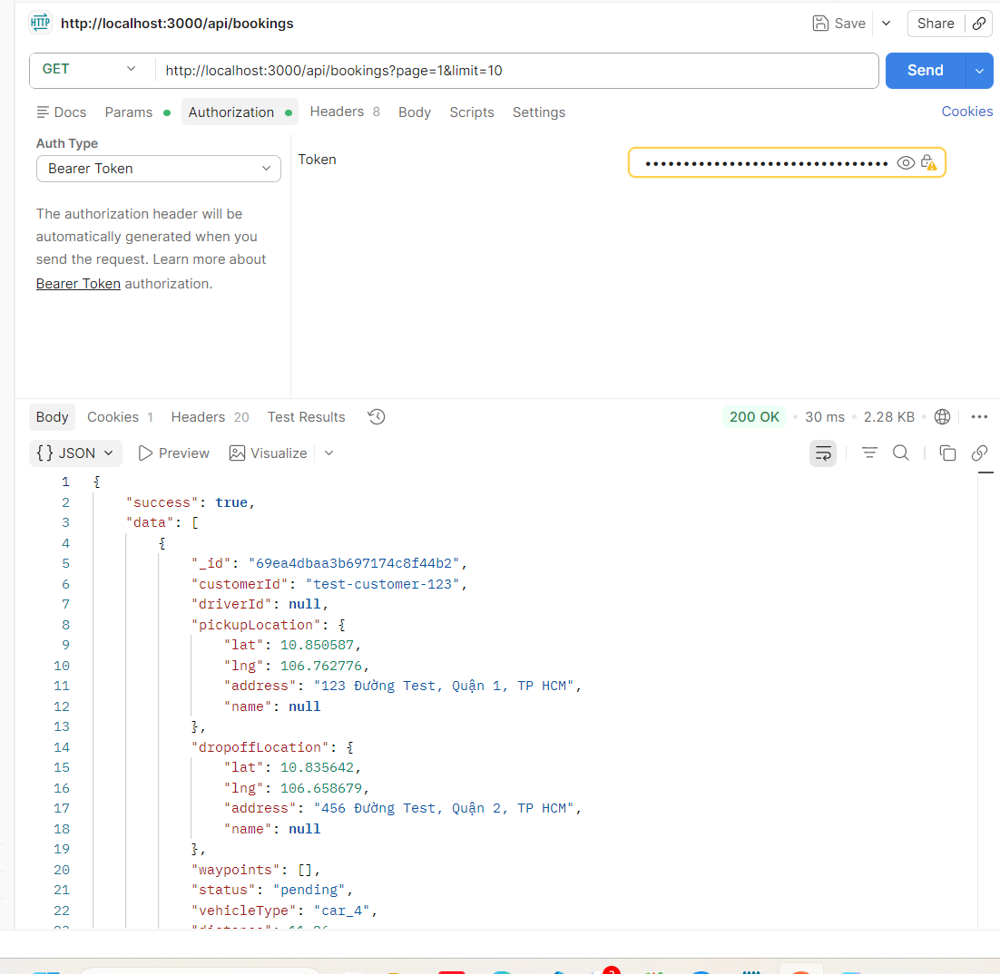

TC11
POST http://localhost:3000/api/bookings
{
  "dropoffLocation": {
    "lat": 10.835642,
    "lng": 106.658679,
    "address": "456 Đường Test"
  },
  "vehicleType": "car_4",
  "paymentMethod": "cash",
  "distance": 11.26,
  "duration": 23
}
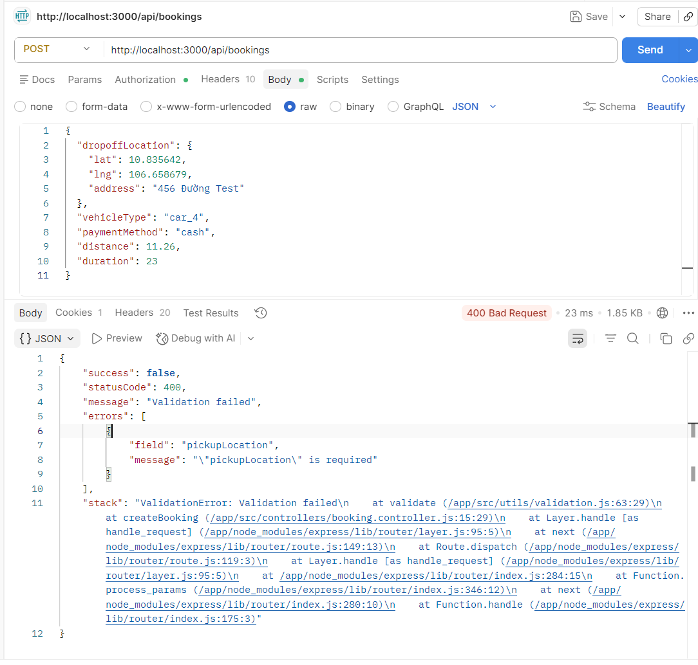

TC12
POST http://localhost:3000/api/bookings
{
  "pickupLocation": {
    "lat": "abc",
    "lng": 106.762776,
    "address": "123 Đường Test, Quận 1"
  },
  "dropoffLocation": {
    "lat": 10.835642,
    "lng": 106.658679,
    "address": "456 Đường Test, Quận 2"
  },
  "vehicleType": "car_4",
  "paymentMethod": "cash",
  "distance": 11.26,
  "duration": 23
}
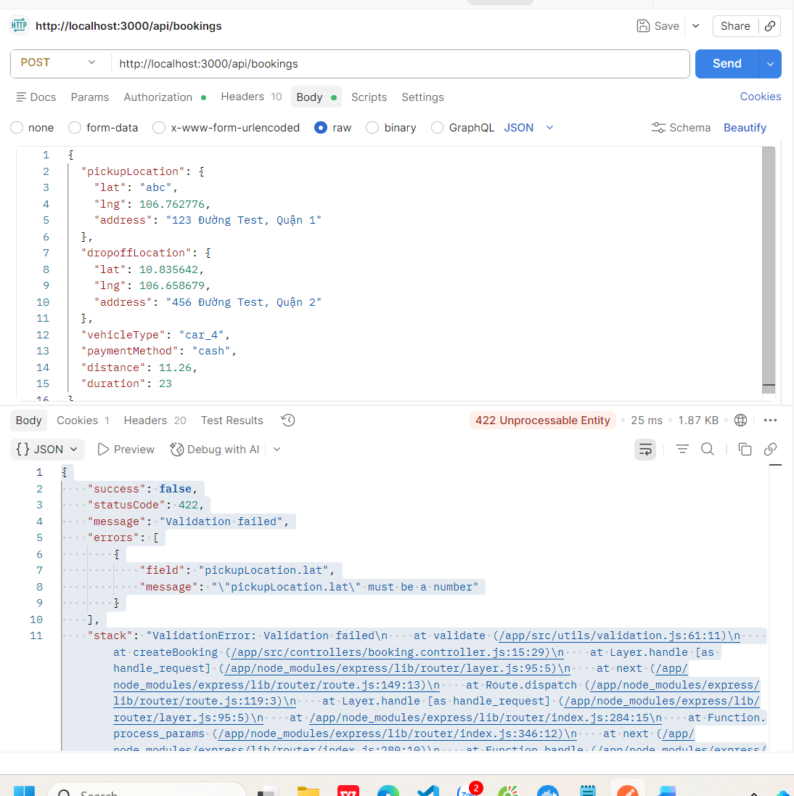

TC13
POST http://localhost:3000/api/bookings
{
  "pickupLocation": {
    "lat": 10.850587,
    "lng": 106.762776,
    "address": "123 Đường Test, Quận 1, TP HCM"
  },
  "dropoffLocation": {
    "lat": 10.835642,
    "lng": 106.658679,
    "address": "456 Đường Test, Quận 2, TP HCM"
  },
  "vehicleType": "car_4",
  "paymentMethod": "cash",
  "distance": 11.26,
  "duration": 23
}

STATUS PENDING LÀ ĐƯỢC

TC20
POST http://localhost:3000/api/bookings
body
{
  "pickupLocation": {
    "lat": 10.850587,
    "lng": 106.762776,
    "address": "{{largeAddress}}"
  },
  "dropoffLocation": {
    "lat": 10.835642,
    "lng": 106.658679,
    "address": "456 Đường Test, Quận 2"
  },
  "vehicleType": "car_4",
  "paymentMethod": "cash",
  "distance": 11.26,
  "duration": 23
}

script
const largeString = "A".repeat(1500000);
pm.variables.set("largeAddress", largeString);
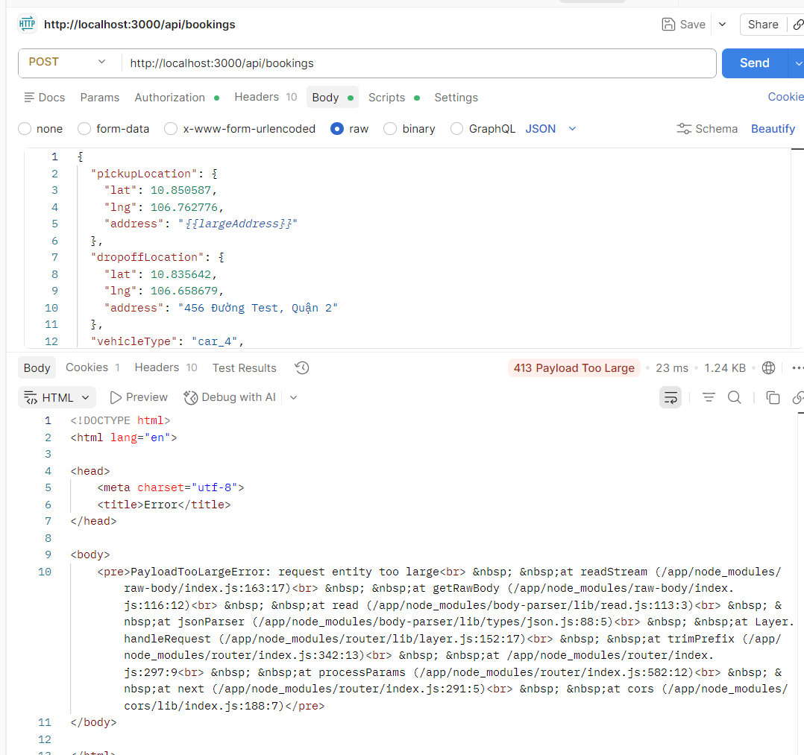

TC21 + TC22
POST http://localhost:3000/api/bookings

{
  "pickupLocation": {
    "lat": 10.850587,
    "lng": 106.762776,
    "address": "123 Đường Test, Quận 1"
  },
  "dropoffLocation": {
    "lat": 10.835642,
    "lng": 106.658679,
    "address": "456 Đường Test, Quận 2"
  },
  "vehicleType": "car_4",
  "paymentMethod": "cash",
  "distance": 11.26,
  "duration": 23
}
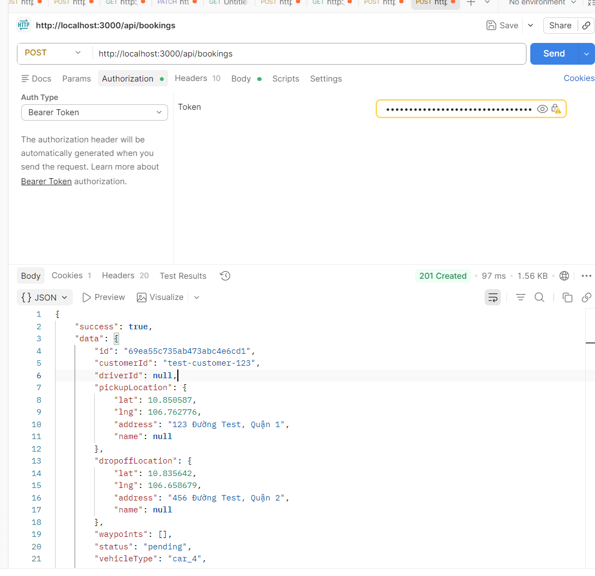

TC31
POST http://localhost:3000/api/bookings

{
  "pickupLocation": {
    "lat": 10.850587,
    "lng": 106.762776,
    "address": "123 Đường Test, Quận 1"
  },
  "dropoffLocation": {
    "lat": 10.835642,
    "lng": 106.658679,
    "address": "456 Đường Test, Quận 2"
  },
  "vehicleType": "car_4",
  "paymentMethod": "cash",
  "distance": 11.26,
  "duration": 23
}
--XEM DATABASE
Bước 1: Kết nối MongoDB
docker exec -it cab_mongodb mongosh -u admin -p password123 --authenticationDatabase admin
Bước 2: Chọn database booking
use booking_db
Bước 3: Xem tất cả booking
db.bookings.find().pretty()
Bước 4: Xem 1 booking cụ thể (theo id)
db.bookings.findOne({ _id: ObjectId("69ea571535ab473abc4e6cd3") })
Bước 5: Xem số lượng booking
db.bookings.countDocuments()

TC35
curl -X POST http://localhost:3000/api/bookings \
  -H "Content-Type: application/json" \
  -H "Authorization: Bearer $TOKEN" \
  -d '{"pickupLocation":{"lat":10.850587,"lng":106.762776,"address":"123 Test"},"dropoffLocation":{"lat":10.835642,"lng":106.658679,"address":"456 Test"},"vehicleType":"car_4","paymentMethod":"cash","distance":11.26,"duration":23}' &

curl -X POST http://localhost:3000/api/bookings \
  -H "Content-Type: application/json" \
  -H "Authorization: Bearer $TOKEN" \
  -d '{"pickupLocation":{"lat":10.850587,"lng":106.762776,"address":"123 Test"},"dropoffLocation":{"lat":10.835642,"lng":106.658679,"address":"456 Test"},"vehicleType":"car_4","paymentMethod":"cash","distance":11.26,"duration":23}' &

