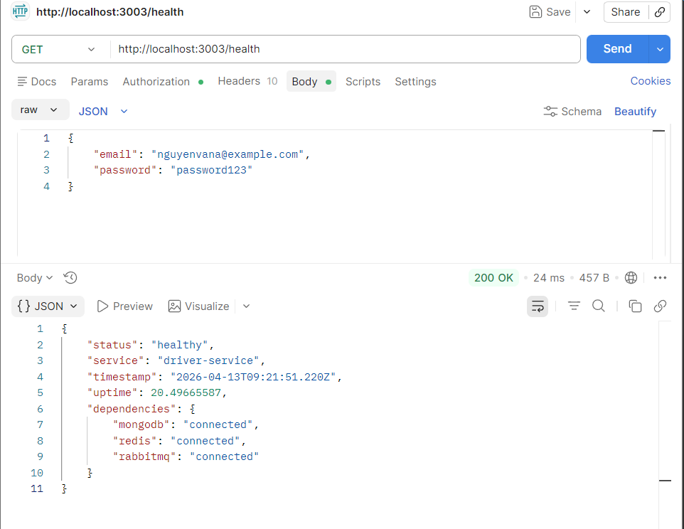
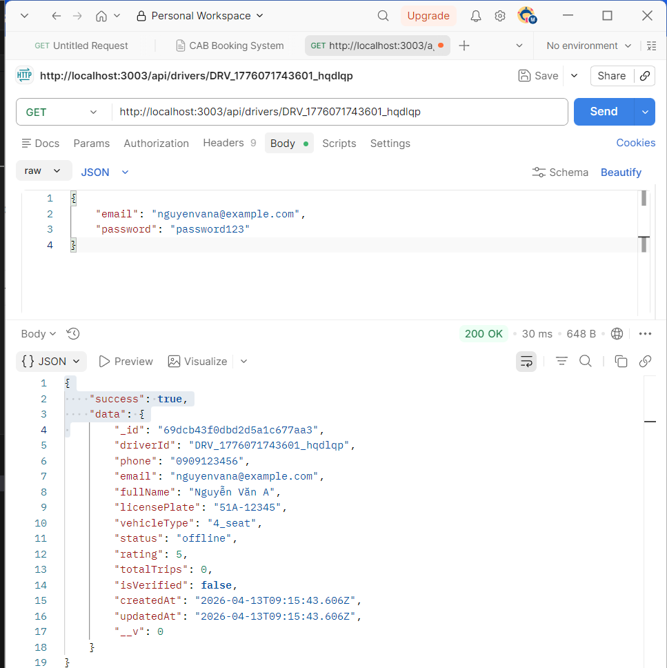
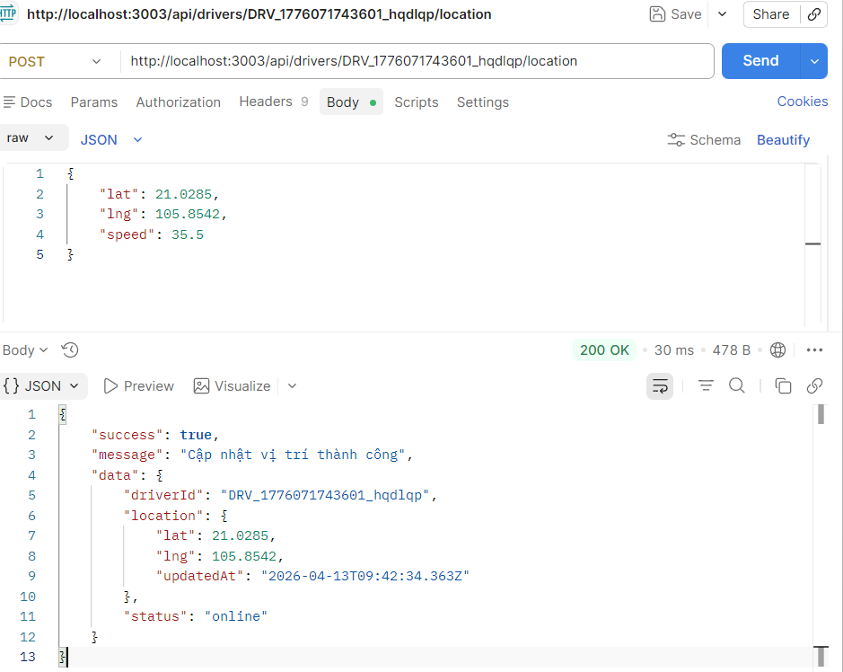
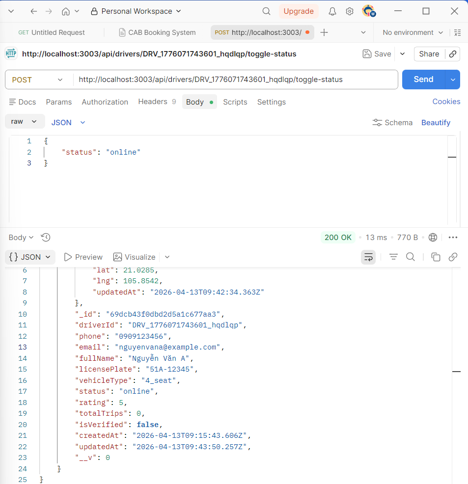
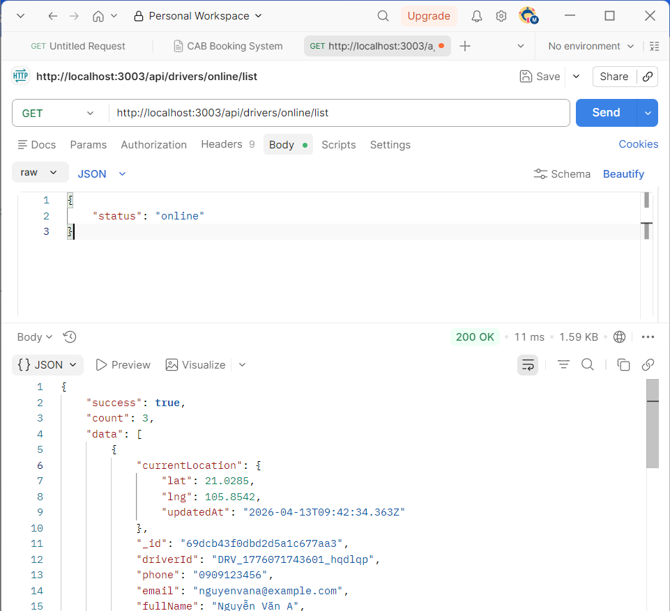
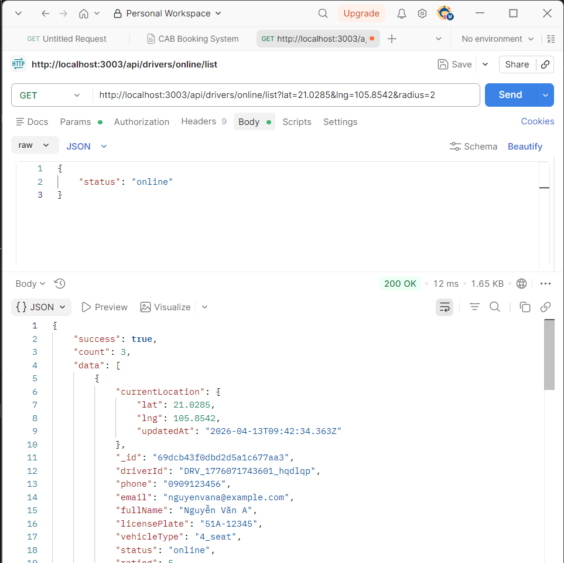
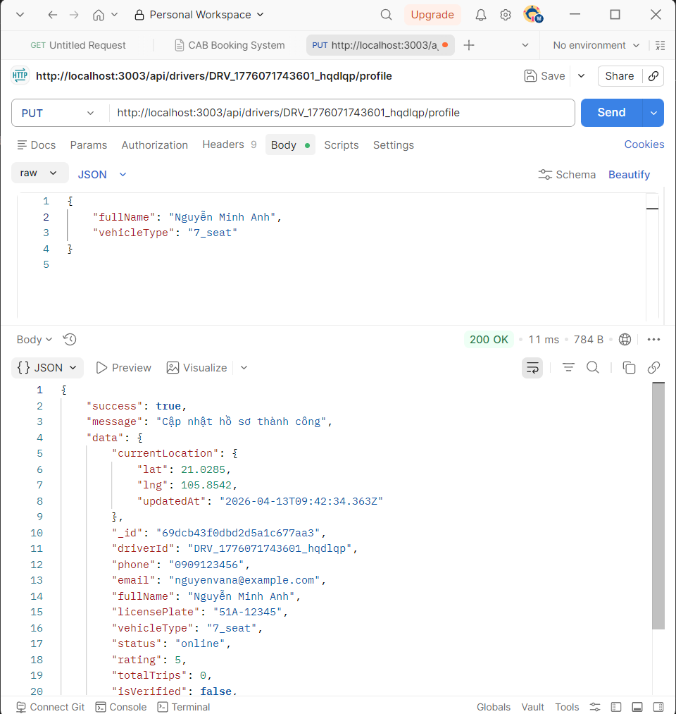
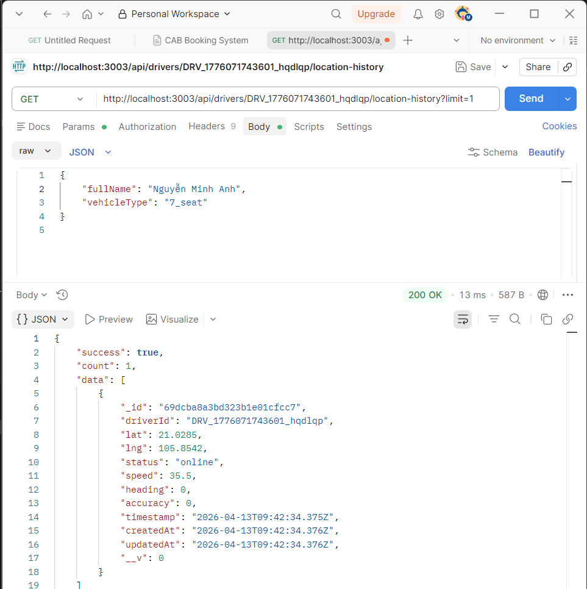

1. Health Check - Kiểm tra service
Phương thức: GET
URL: http://localhost:3003/health
Response: 

2. LẤY THÔNG TIN TÀI XẾ (Không cần token)
Method: GET
URL: http://localhost:3003/api/drivers/DRV_1776071743601_hqdlqp
Response: 

3. CẬP NHẬT VỊ TRÍ
Method	POST
URL	http://localhost:3003/api/drivers/DRV_1776071743601_hqdlqp/location
Body:
json
{
    "lat": 21.0285,
    "lng": 105.8542,
    "speed": 35.5,
    "heading": 180
}
Response: 

4. CHUYỂN ONLINE
Method	POST
URL	http://localhost:3003/api/drivers/DRV_1776071743601_hqdlqp/toggle-status
Body:
json
{
    "status": "online"
}
Response: 

5. DANH SÁCH TÀI XẾ ONLINE
Method	GET
URL	http://localhost:3003/api/drivers/online/list
Response: 

6. DANH SÁCH TÀI XẾ GẦN (BÁN KÍNH 2KM)
Method	GET
URL	http://localhost:3003/api/drivers/online/list?lat=21.0285&lng=105.8542&radius=2
Response: 

7. CẬP NHẬT HỒ SƠ
Method	PUT
URL	http://localhost:3003/api/drivers/DRV_1776071743601_hqdlqp/profile
Body:
json
{
    "fullName": "Nguyễn Văn A (Đã cập nhật)",
    "vehicleType": "7_seat"
}
Response: 

8. LỊCH SỬ VỊ TRÍ
Method	GET
URL	http://localhost:3003/api/drivers/DRV_1776071743601_hqdlqp/location-history?limit=10
Response: 

9. CHUYỂN OFFLINE
Method	POST
URL	http://localhost:3003/api/drivers/DRV_xxx/toggle-status
Body:
json
{
    "status": "offline"
}
Response: 

