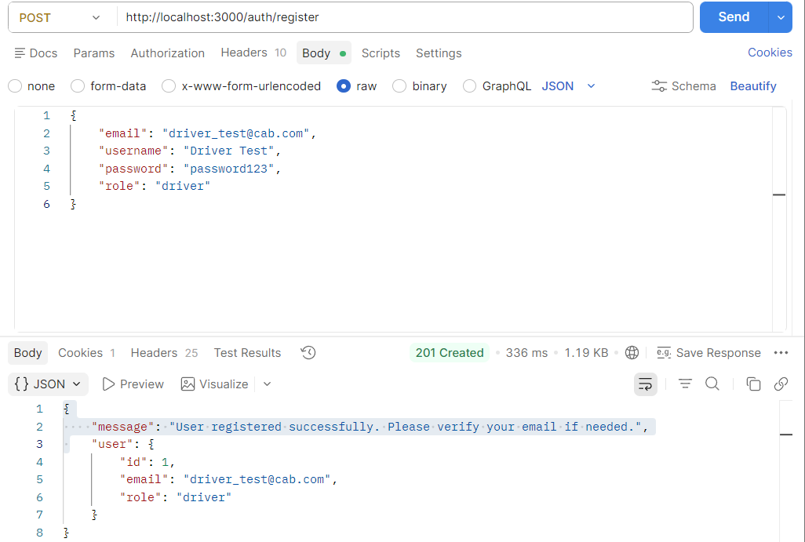
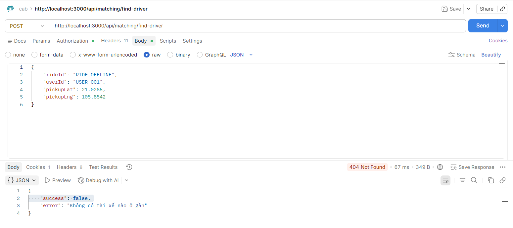
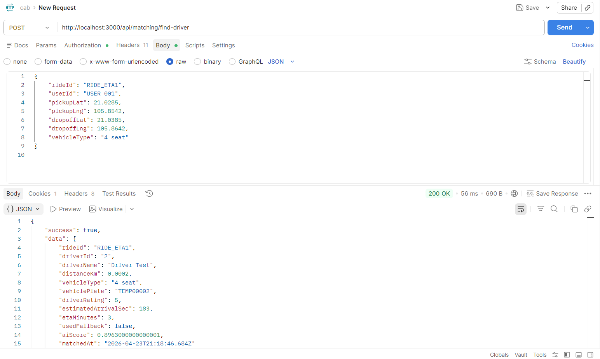
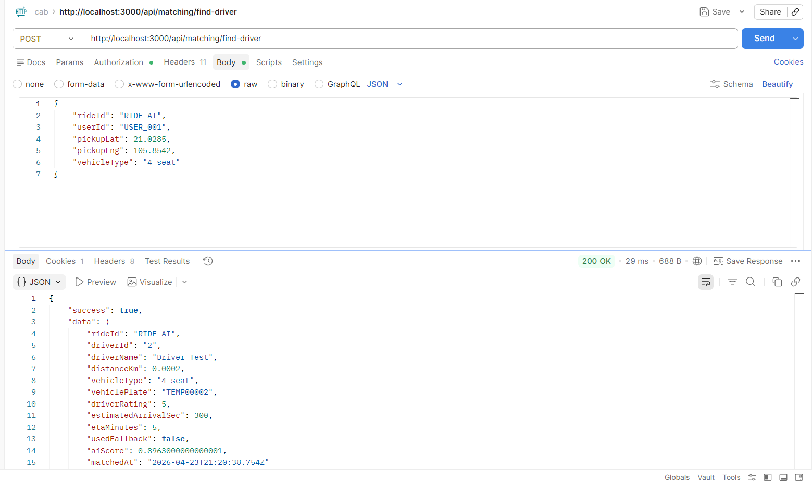
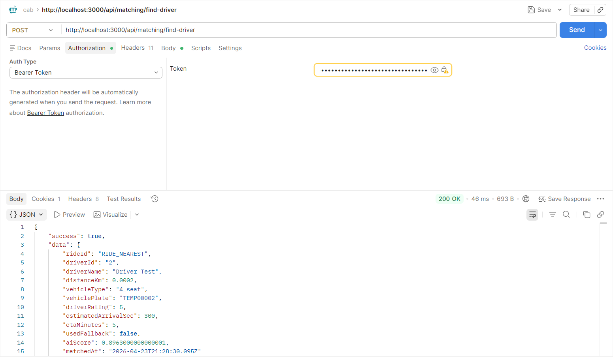
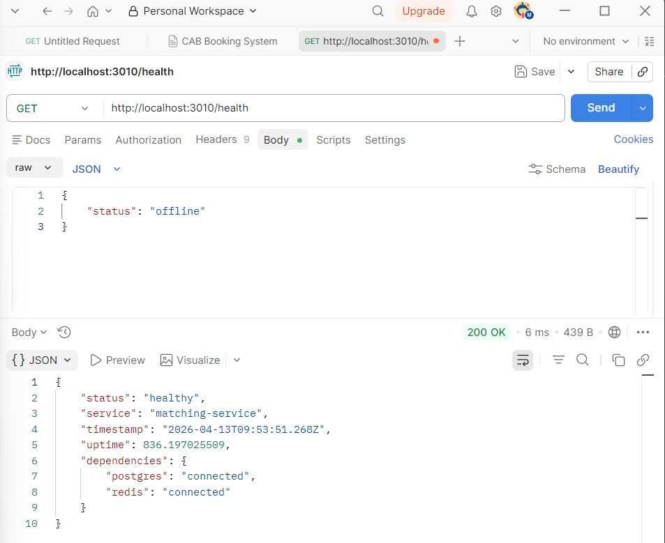
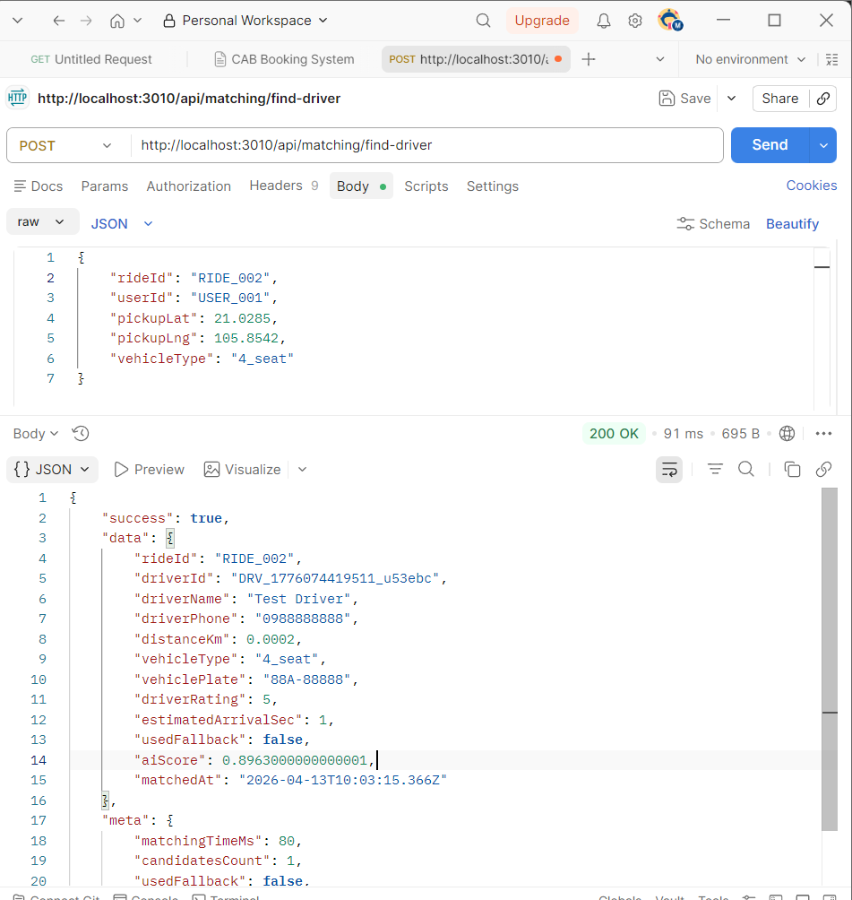
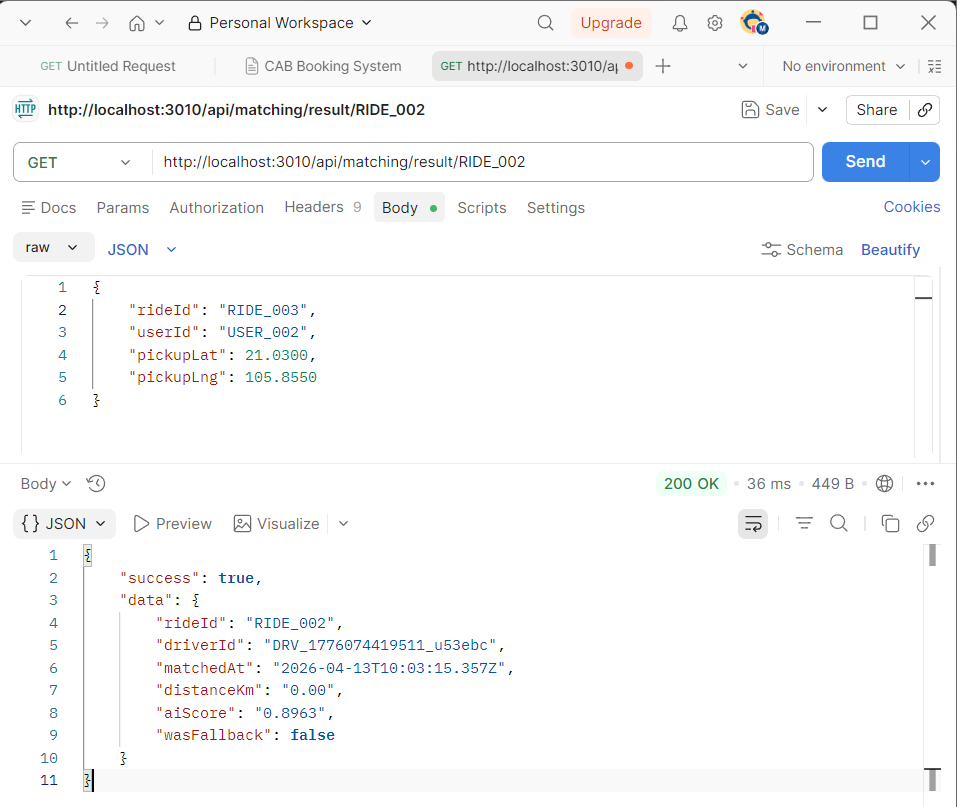
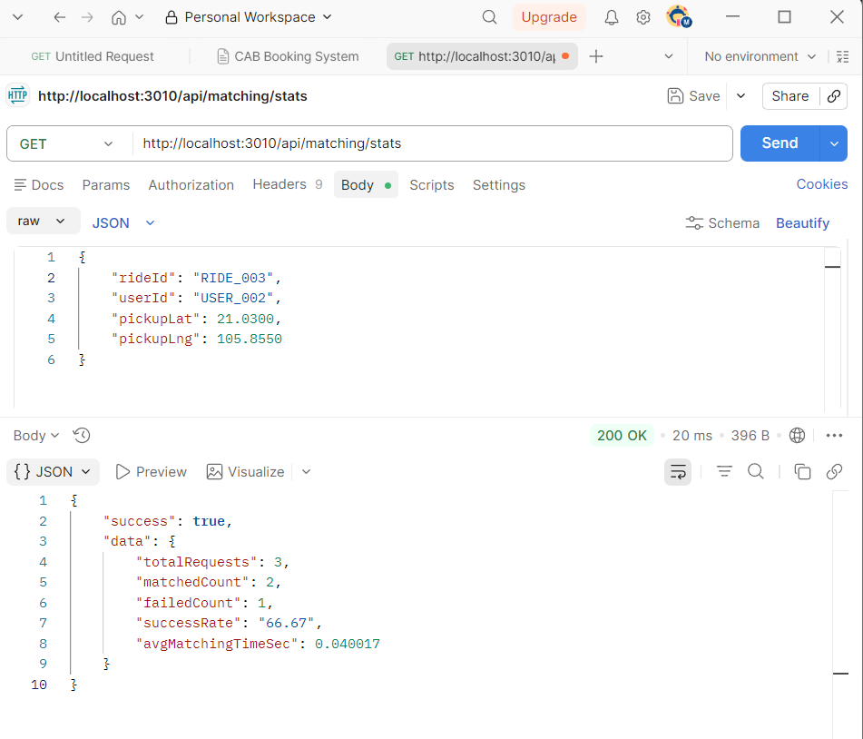

1.  ĐĂNG KÝ TÀI KHOẢN DRIVER
Method: POST
URL: http://localhost:3000/auth/register
Headers: Content-Type: application/json
Body:
{
    "email": "driver_test@cab.com",
    "username": "Driver Test",
    "password": "password123",
    "role": "driver"
}

2. ĐĂNG NHẬP LẤY TOKEN
Method: POST
URL: http://localhost:3000/auth/login
Headers: Content-Type: application/json
Body:
{
    "email": "driver_test@cab.com",
    "password": "password123"
}

3. TC13 - Level 2: Driver offline không nhận booking (bước 2 - gọi matching)
POST http://localhost:3000/api/matching/find-driver
Headers:
  Authorization: Bearer {{TOKEN}}
  Content-Type: application/json
Body: {
    "rideId": "RIDE_OFFLINE",
    "userId": "USER_001",
    "pickupLat": 21.0285,
    "pickupLng": 105.8542
}

4. TC21 - Level 3: Matching có ETA (có dropoff)
POST http://localhost:3000/api/matching/find-driver
Body: {
    "rideId": "RIDE_ETA",
    "userId": "USER_001",
    "pickupLat": 21.0285,
    "pickupLng": 105.8542,
    "dropoffLat": 21.0385,
    "dropoffLng": 105.8642,
    "vehicleType": "4_seat"
}

5. TC22 - Level 3: AI chọn driver online (không dropoff)
POST http://localhost:3000/api/matching/find-driver
Body: {
    "rideId": "RIDE_AI",
    "userId": "USER_001",
    "pickupLat": 21.0285,
    "pickupLng": 105.8542,
    "vehicleType": "4_seat"
}

6. TC51 - Level 6: Chọn driver gần nhất (cần 2 driver online)
POST http://localhost:3000/api/matching/find-driver
Body: {
    "rideId": "RIDE_NEAREST",
    "userId": "USER_001",
    "pickupLat": 21.0285,
    "pickupLng": 105.8542
}

MATCHING SERVICE (Port 3010)
1. MATCHING HEALTH CHECK
Method	GET
URL	http://localhost:3010/health
Response: 

2. TÌM TÀI XẾ (GHÉP ĐÔI)
Method	POST
URL	http://localhost:3010/api/matching/find-driver
Headers	Content-Type: application/json
Body:
json
{
    "rideId": "RIDE_001",
    "userId": "USER_001",
    "pickupLat": 21.0285,
    "pickupLng": 105.8542,
    "vehicleType": "4_seat"
}
Response: 

3. TÌM TÀI XẾ (KHÔNG LỌC LOẠI XE)
URL	http://localhost:3010/api/matching/find-driver
Body
json
{
    "rideId": "RIDE_002",
    "userId": "USER_002",
    "pickupLat": 21.0300,
    "pickupLng": 105.8550
}
Response: 

4. LẤY KẾT QUẢ GHÉP ĐÔI
Key	Value
Method	GET
URL	http://localhost:3010/api/matching/result/RIDE_002
Response: 

5. THỐNG KÊ GHÉP ĐÔI
Method	GET
URL	http://localhost:3010/api/matching/stats
Response: 

