import thu viện cho noti
npm install socket.io-client
TC09: Notification gửi thành công
Mô tả: Kiểm tra khả năng nhận và xử lý thông báo khi có sự kiện Booking hoặc Payment.
TEST BANG SOCKET.IO THEM TOKEN MS CHAY 
lam theo nhu ảnh 
muốn gửi thông báo cho thanh toán dc khởi tạo phương thức thanh toán là 
 "paymentMethod": "card",
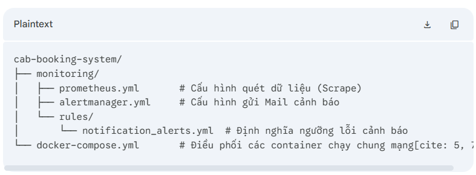

1. Thông tin Test Case
Context: Booking đã được tạo thành công trong hệ thống.

Input (JSON):

JSON
{
  "user_id": "1",
  "message": "Your ride is confirmed"
}
Endpoint: POST {{gateway_url}}/api/notifications/test

2. Các bước thực hiện
Bước 1: Mở Postman, chọn phương thức POST.

Bước 2: Nhập URL:POST
 https://localhost:3000/api/notifications/test (hoặc port 3004 nếu bắn trực tiếp).

Bước 3: Tại tab Body -> chọn raw -> định dạng JSON. Dán cục Input phía trên vào.

Bước 4: Nhấn Send.

3. Kết quả mong đợi (Expected Result)
HTTP Status: 200 OK.

Response Body: Hệ thống trả về trạng thái "status": "sent".

Log: Trong Terminal của cab_notification, xuất hiện log xác nhận gửi thông báo thành công.
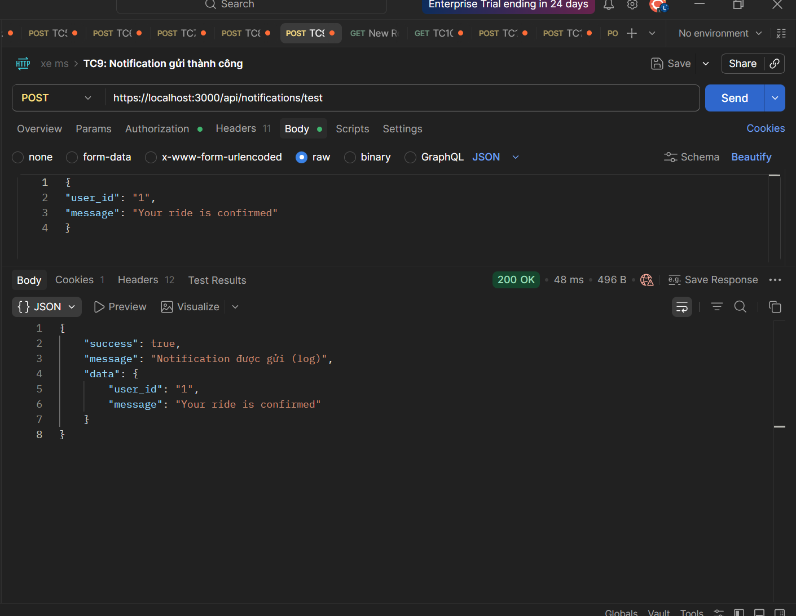
 socket.io
TC24
Cách thực hiện trên Postman để thầy thấy "xịn" nhất:
Thiết lập: Chọn phương thức GET.

Nhập URL: https://localhost:3000/api/notifications/1.
https://localhost:3000/api/notifications/idkhachhang

Header: Đảm bảo có Authorization: Bearer {{token}} nếu bạn đã bật middleware auth cho route này.

Kiểm tra:

Nếu trong phần data có các object thông báo -> Passed.

Nếu unreadCount (khi gọi endpoint /unread-count) lớn hơn 0 -> Hệ thống tính toán badge chính xác.
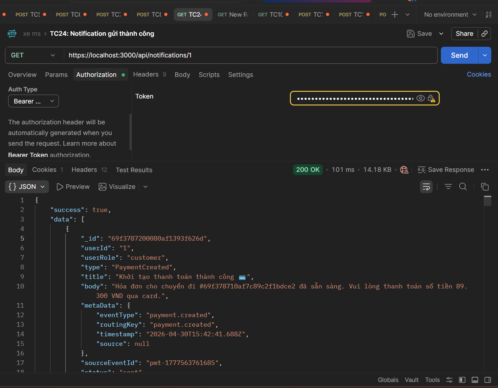
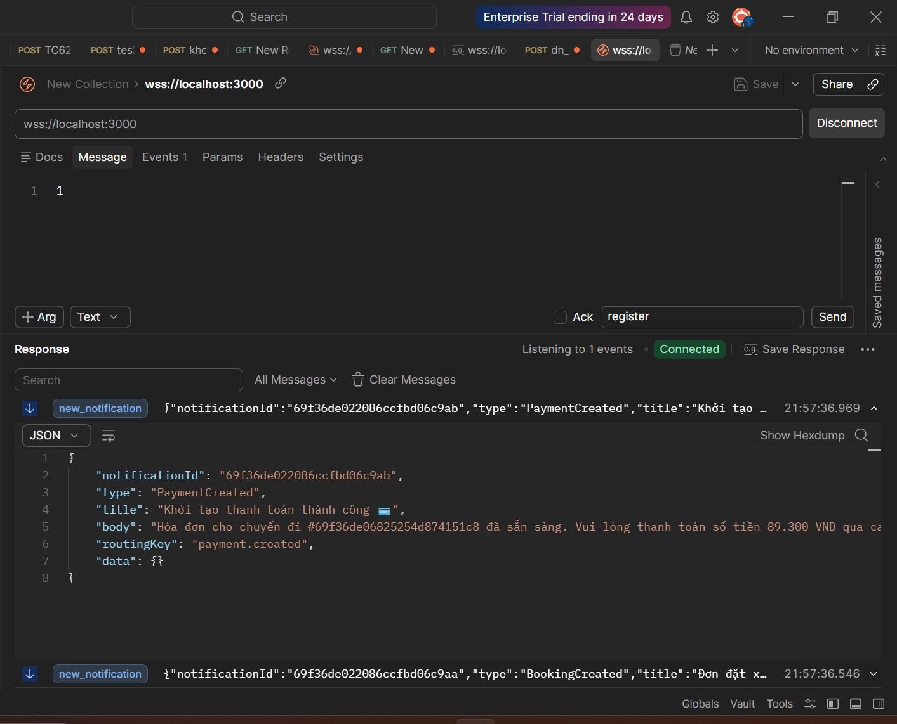 test tren socket io
PS C:\Users\User\Downloads\flodel\cab-booking-system_N22> docker exec -it cab_redis redis-cli
127.0.0.1:6379> keys feature:eta:*
1) "feature:eta:1777570215741"
127.0.0.1:6379> 

What's next:
    Try Docker Debug for seamless, persistent debugging tools in any container or image → docker debug cab_redis
    Learn more at https://docs.docker.com/go/debug-cli/
docker exec -it cab_redis redis-cli
keys feature:eta:*
tc116
Cấu trúc thư mục monitoring

Bước 1: Khởi động hệ thốngMở Terminal tại thư mục gốc và chạy lệnh:PowerShelldocker-compose up -d --build prometheus alertmanager node-exporter
Bước 2: Kiểm tra trạng thái kết nốiTruy cập http://localhost:9090/targets để đảm bảo:cab-notification-service (Port 3040) trạng thái UP.  node-exporter trạng thái UP.  Bước 3: Kịch bản kiểm thử (Simulate Error)Sử dụng Postman gọi liên tục vào API gây lỗi giả lập: POST /api/notifications/simulate-crash[cite: 3].
Kiểm tra trang http://localhost:9090/alerts, trạng thái HighErrorRate sẽ chuyển từ Inactive → Pending → FIRING (Màu đỏ) sau 10 giây.  Kiểm tra hộp thư Gmail hle26625@gmail.com để nhận email cảnh báo chi tiết.  
Test tren postmain bắn lỗi 100 lan 

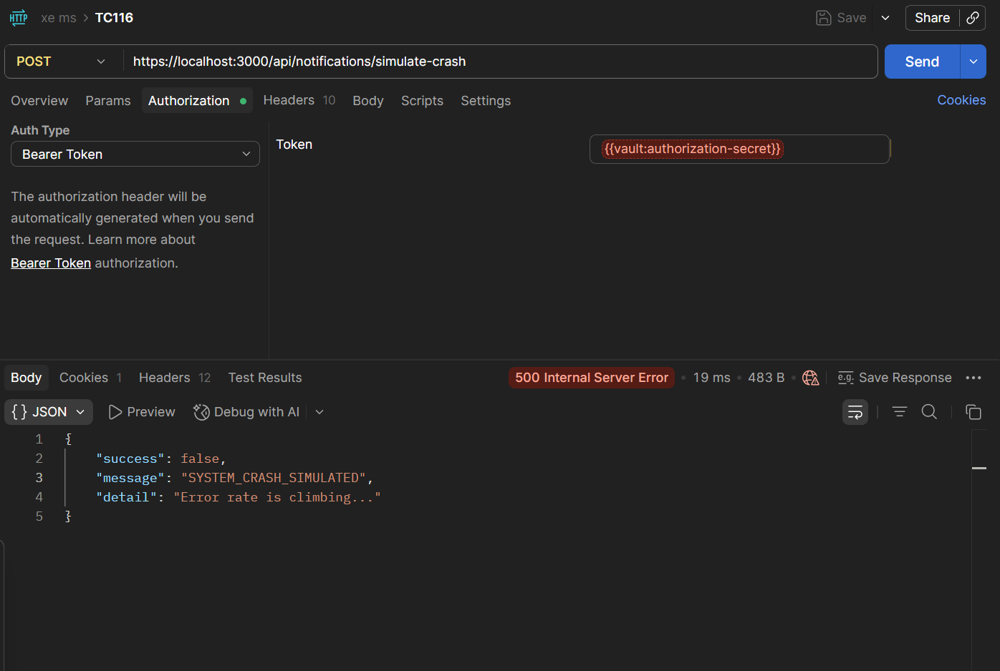
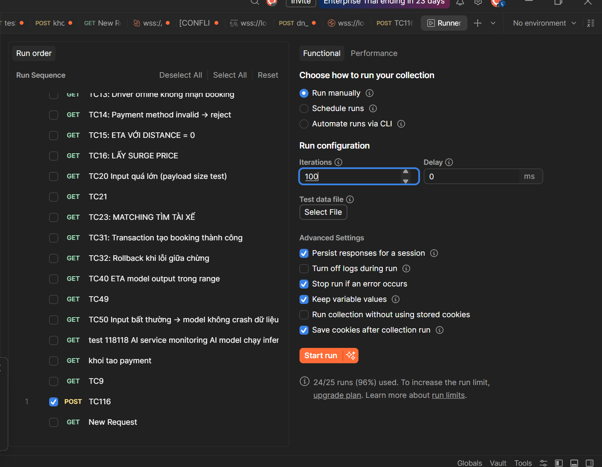
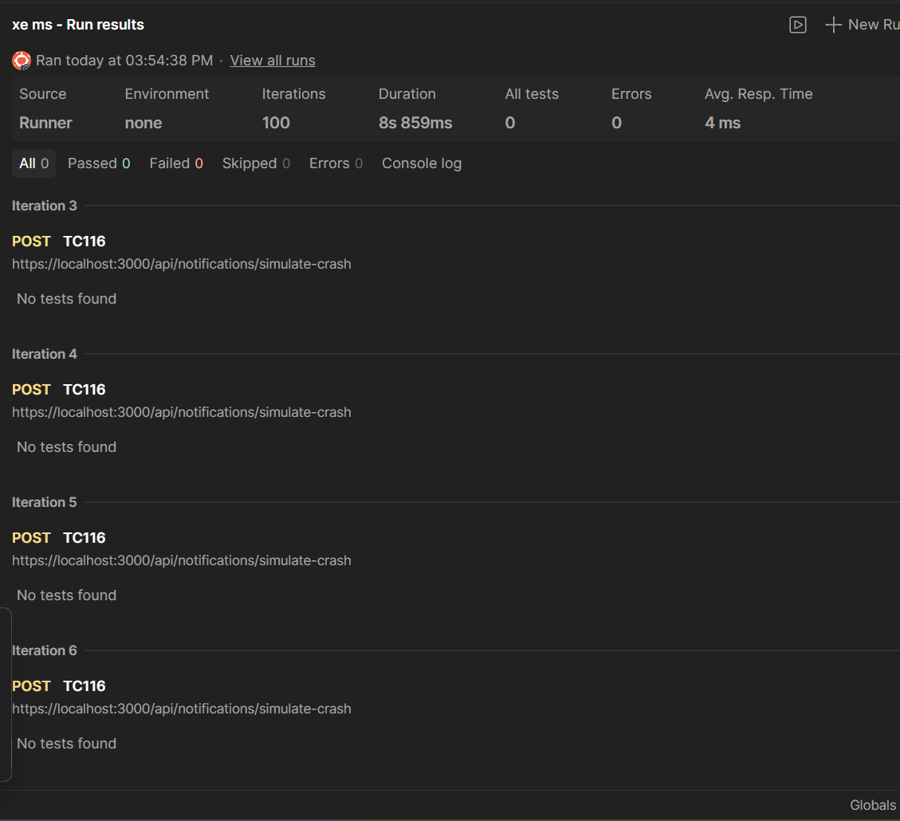
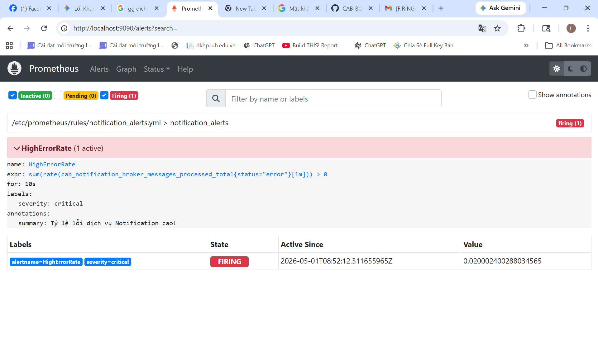
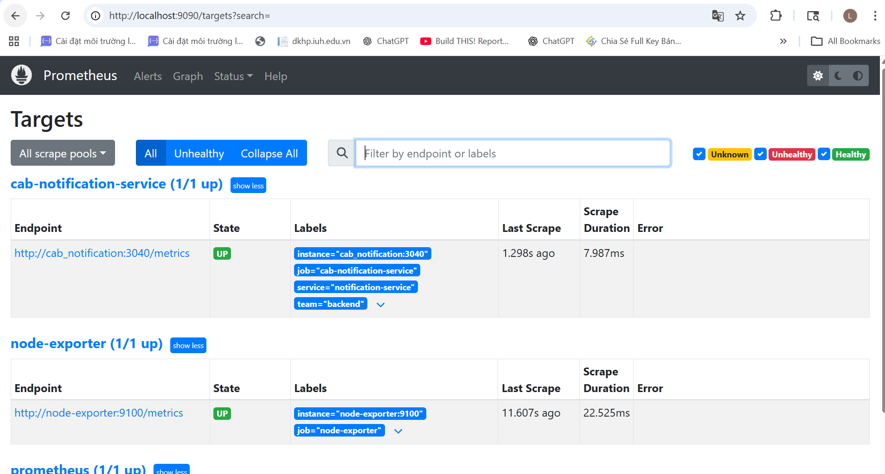

📝 Kết quả đạt đượcMetric ghi nhận: 
Tỷ lệ lỗi được Prometheus tính toán chính xác bằng hàm rate() trong 1 phút[cite: 3].
Email Alert: Thông báo gửi về có đầy đủ thông tin: Tên lỗi, Môi trường (Production), Độ nghiêm trọng (Critical) và Nội dung lỗi[cite: 5, 6].

Bảo mật: Tách biệt luồng dữ liệu ứng dụng (mTLS 3004) và luồng giám sát (HTTP 3040) giúp hệ thống chạy ổn định và an toàn. 
docker restart prometheus
TC25/TC26

Môi trường Test (Development)
Socket URL: wss://localhost:3000

Công cụ test: Postman / Insomnia (socketIO)

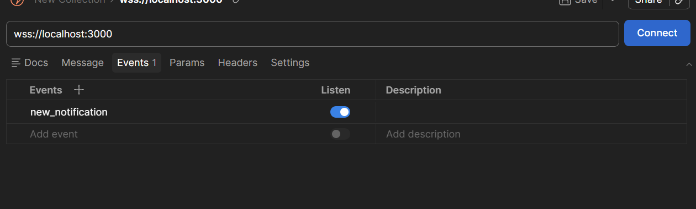
📡 Luồng sự kiện Socket (Real-time Events)
Khi có sự kiện matching hoặc booking, hệ thống sẽ phát (emit) một event có tên là new_notification.
Trạng thái kết nối: Yêu cầu đăng ký event trước khi nhận dữ liệu (ví dụ: register). 
Cấu trúc Data nhận được:
JSON
{
    "notificationId": "69fa3712dfd0c2c049123f5a",
    "type": "DriverMatched",
    "title": "Đã tìm thấy tài xế!",
    "body": "Tài xế Tài xế Mới 234 (TEMP00002) đang đến. ETA: 31.06 phút.",
    "routingKey": "driver.matched",
    "data": {
        "rideId": "69fa32bb27c93ee3708772ec",
        "userId": "1",
        "driverId": "DRV_1778001941418_qhzstd",
        "driverName": "Tài xế Mới 234",
        "vehicleType": "4_seat"
    }
}
làm như ảnh 
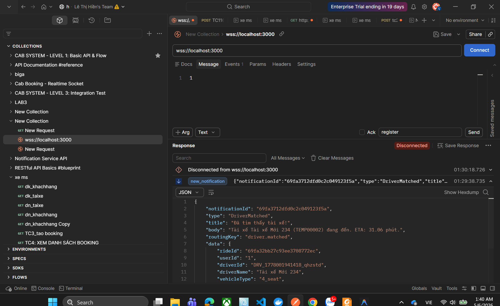
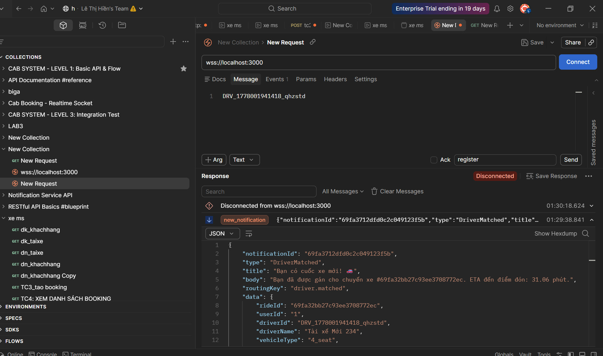
test 26 tren postmain
gui thong bao cho tai
https://localhost:3000/api/notifications/DRV_1778001941418_qhzstd
 driverId: "DRV_1778001941418_qhzstd",
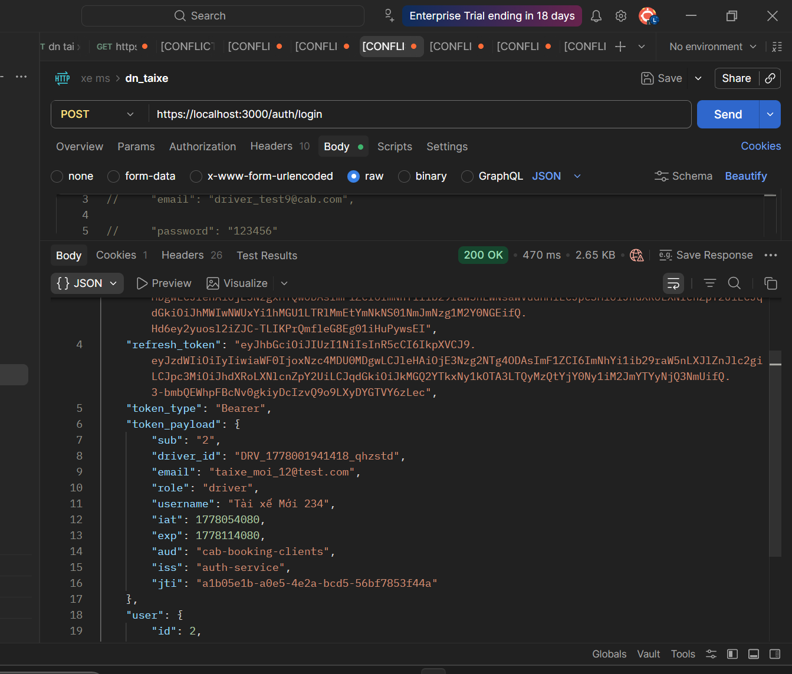
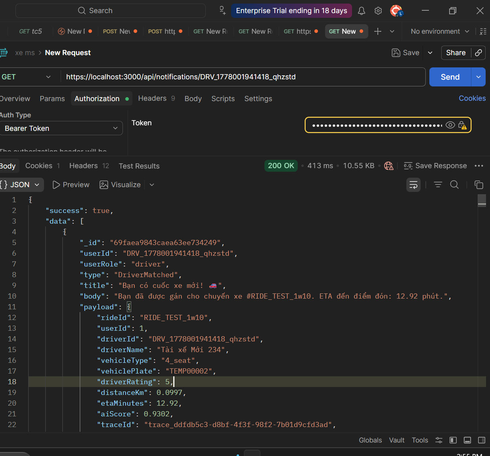
gui thong bao cho khach hang
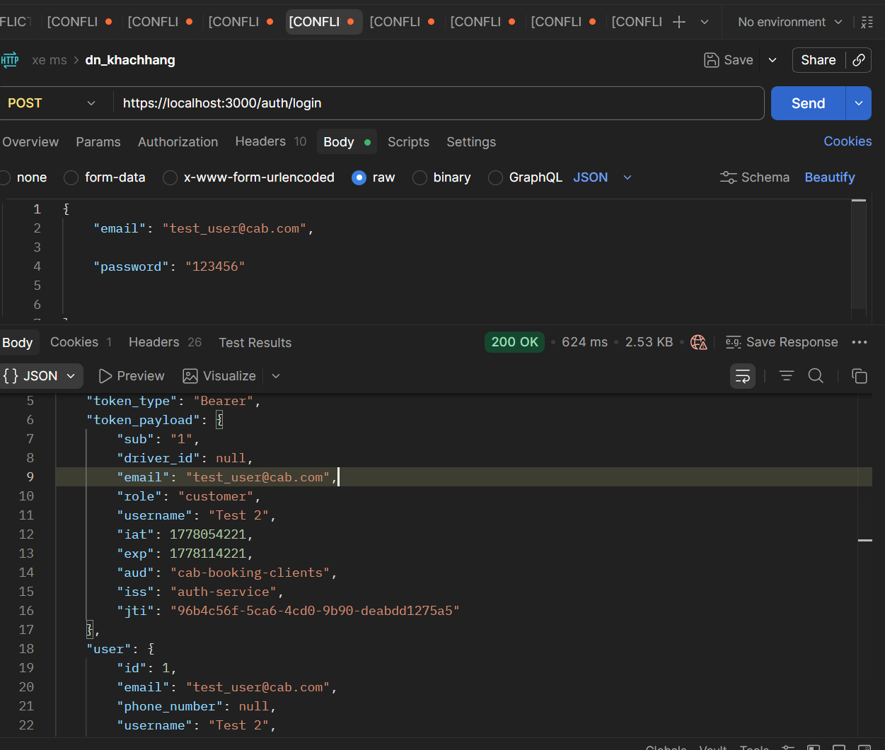
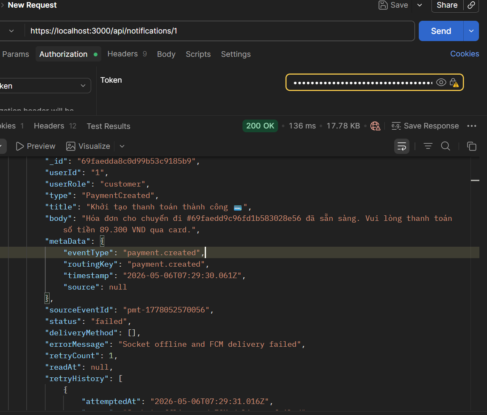

