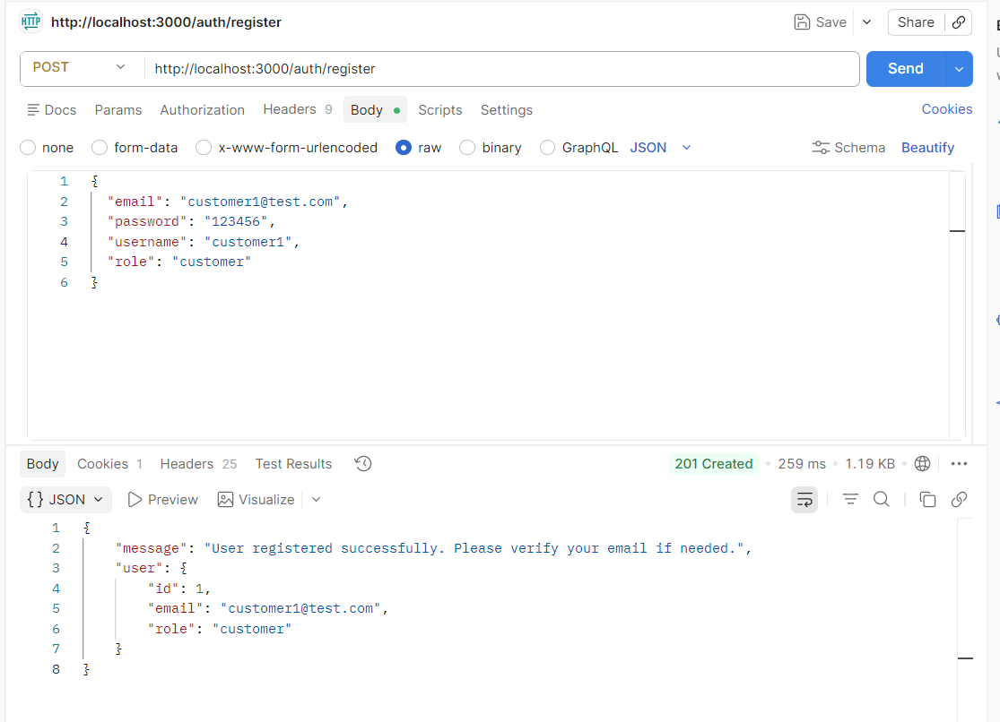
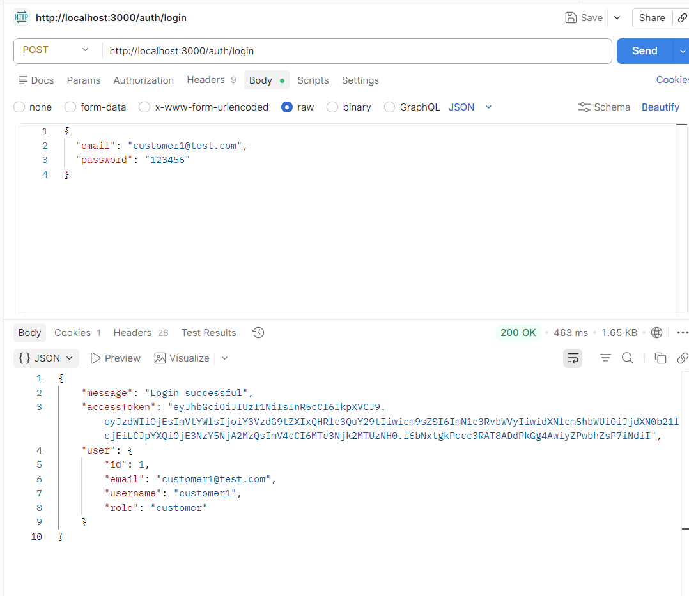
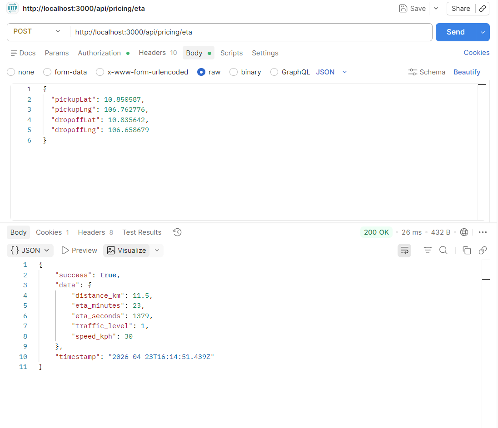
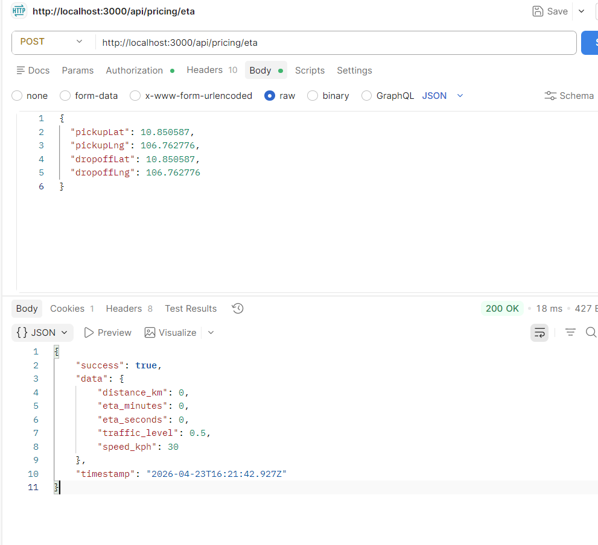
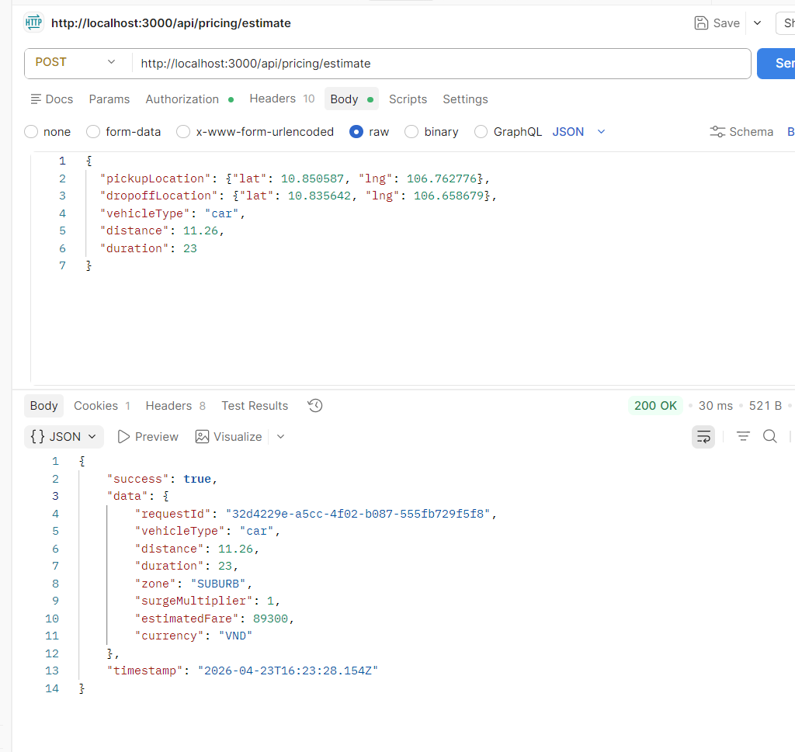
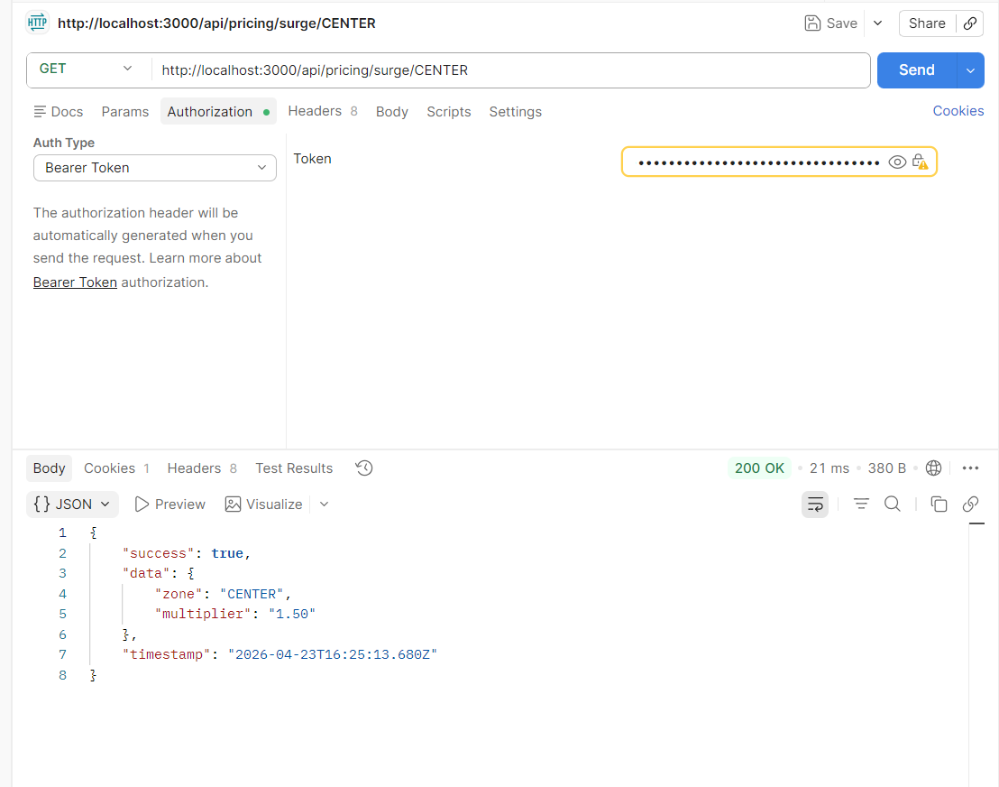
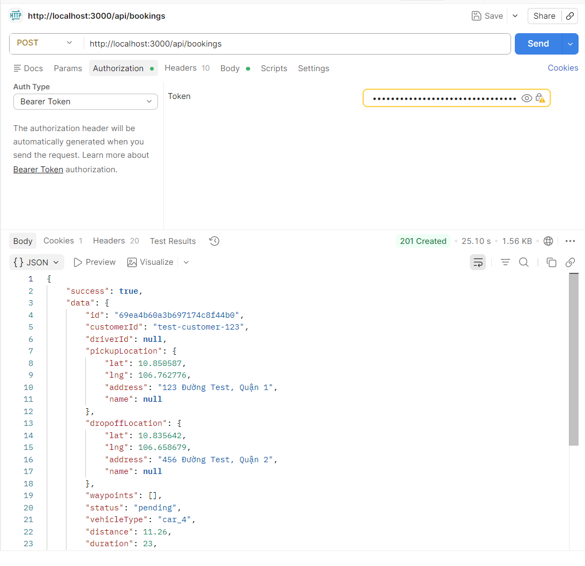

ĐĂNG KÝ CUSTOMER
POST http://localhost:3000/auth/register
{
  "email": "customer1@test.com",
  "password": "123456",
  "username": "customer1",
  "role": "customer"
}

ĐĂNG NHẬP LẤY TOKEN
POST http://localhost:3000/auth/login
{
  "email": "customer1@test.com",
  "password": "123456"
}

-----sau khi đăng nhập xong có token mỗi bước tiếp theo đều cần token

TC7 + TC41 Gọi API ETA trả về giá trị > 0
POST http://localhost:3000/api/pricing/eta
{
  "pickupLat": 10.850587,
  "pickupLng": 106.762776,
  "dropoffLat": 10.835642,
  "dropoffLng": 106.658679
}

TC15: ETA VỚI DISTANCE = 0
POST http://localhost:3000/api/pricing/eta
{
  "pickupLat": 10.850587,
  "pickupLng": 106.762776,
  "dropoffLat": 10.850587,
  "dropoffLng": 106.762776
}

TC8 + TC3 + TC22
POST http://localhost:3000/api/pricing/estimate
{
  "pickupLocation": {"lat": 10.850587, "lng": 106.762776},
  "dropoffLocation": {"lat": 10.835642, "lng": 106.658679},
  "vehicleType": "car",
  "distance": 11.26,
  "duration": 23
}

✅ TC8: giá hợp lệ
✅ TC3 + TC22: ETA + Pricing thành công

TC16: SURGE >= 1
GET http://localhost:3000/api/pricing/surge/CENTER

TC30
POST http://localhost:3000/api/bookings
{
  "pickupLocation": {"lat": 10.850587, "lng": 106.762776, "address": "123 Đường Test, Quận 1"},
  "dropoffLocation": {"lat": 10.835642, "lng": 106.658679, "address": "456 Đường Test, Quận 2"},
  "vehicleType": "car_4",
  "paymentMethod": "cash",
  "distance": 11.26,
  "duration": 23
}

# Bước 1: Clone dự án
git clone ........
cd cab-system-backend

# Bước 2: Tạo file .env (nếu chưa có)
# Copy nội dung .env.example vào .env

# 3. Chạy Docker (tự động build và cài dependencies)
docker-compose up -d postgres redis rabbitmq pricing-service

# 4. Đợi database khởi động
sleep 15

# 5. Seed dữ liệu
docker exec -it cab_postgres psql -U admin -d pricing_db -f /docker-entrypoint-initdb.d/init.sql

# Bước 6: Kiểm tra service
curl http://localhost:3006/api/v1/health

# Test Postman
1. HEALTH CHECK
GET http://localhost:3006/api/v1/health
kết quả
{
    "status": "healthy",
    "timestamp": "2026-04-12T08:14:15.681Z",
    "uptime": 3105.491258903,
    "services": {
        "database": {
            "status": "connected"
        }
    }
}

2. TÍNH GIÁ (ESTIMATE)
POST http://localhost:3006/api/v1/estimate
Body (raw - JSON):
{
  "pickupLocation": {
    "lat": 10.7626,
    "lng": 106.6823,
    "address": "Đại học Khoa học Tự nhiên, Quận 5"
  },
  "dropoffLocation": {
    "lat": 10.7769,
    "lng": 106.7009,
    "address": "456 Đường XYZ, Quận 2"
  },
  "vehicleType": "car_4",
  "paymentMethod": "cash",
  "distance": 5.2,
  "duration": 15
}
kết quả
{
    "success": true,
    "data": {
        "requestId": "96d72d54-4800-4434-990b-3df477728b5d",
        "vehicleType": "car",
        "distance": 5.2,
        "duration": 15,
        "zone": "CENTER",
        "surgeMultiplier": 1.8,
        "estimatedFare": 91800,
        "currency": "VND"
    },
    "timestamp": "2026-04-12T08:17:51.100Z"
}

3.  LẤY DANH SÁCH PRICING
GET http://localhost:3006/api/v1/pricing
kết quả
{
    "success": true,
    "data": [
        {
            "id": 1,
            "vehicle_type": "car",
            "base_fare": "10000.00",
            "per_km_rate": "5000.00",
            "per_minute_rate": "1000.00",
            "created_at": "2026-03-29T06:31:09.044Z",
            "updated_at": "2026-03-29T06:31:09.044Z"
        },
        {
            "id": 2,
            "vehicle_type": "suv",
            "base_fare": "15000.00",
            "per_km_rate": "7000.00",
            "per_minute_rate": "1200.00",
            "created_at": "2026-03-29T06:31:09.044Z",
            "updated_at": "2026-03-29T06:31:09.044Z"
        },
        {
            "id": 3,
            "vehicle_type": "bike",
            "base_fare": "5000.00",
            "per_km_rate": "3000.00",
            "per_minute_rate": "500.00",
            "created_at": "2026-03-29T06:31:09.044Z",
            "updated_at": "2026-03-29T06:31:09.044Z"
        }
    ],
    "timestamp": "2026-04-12T08:19:30.405Z"
}

4. LẤY PRICING THEO LOẠI XE
GET http://localhost:3006/api/v1/pricing/car
kết quả
{
    "success": true,
    "data": {
        "id": 1,
        "vehicle_type": "car",
        "base_fare": "10000.00",
        "per_km_rate": "5000.00",
        "per_minute_rate": "1000.00",
        "created_at": "2026-03-29T06:31:09.044Z",
        "updated_at": "2026-03-29T06:31:09.044Z"
    },
    "timestamp": "2026-04-12T08:21:13.607Z"
}

5. LẤY DANH SÁCH SURGE ZONES
GET http://localhost:3006/api/v1/surge
kết quả
{
    "success": true,
    "data": [
        {
            "id": 1,
            "zone": "CENTER",
            "multiplier": "1.50",
            "created_at": "2026-03-29T06:31:09.048Z",
            "updated_at": "2026-03-29T06:31:09.048Z"
        },
        {
            "id": 2,
            "zone": "AIRPORT",
            "multiplier": "2.00",
            "created_at": "2026-03-29T06:31:09.048Z",
            "updated_at": "2026-03-29T06:31:09.048Z"
        },
        {
            "id": 3,
            "zone": "SUBURB",
            "multiplier": "1.00",
            "created_at": "2026-03-29T06:31:09.048Z",
            "updated_at": "2026-03-29T06:31:09.048Z"
        }
    ],
    "timestamp": "2026-04-12T08:22:09.044Z"
}

6. LẤY SURGE THEO ZONE
GET http://localhost:3006/api/v1/surge/CENTER
kết quả:
{
    "success": true,
    "data": {
        "zone": "CENTER",
        "multiplier": "1.50"
    },
    "timestamp": "2026-04-12T08:23:48.689Z"
}

7. ÁP DỤNG PROMOTION
POST http://localhost:3006/api/v1/promotion/apply
Body: {
  "code": "WELCOME50",
  "tripValue": 150000,
  "vehicleType": "car",
  "zone": "CENTER"
}
kết quả: 
{
    "success": true,
    "data": {
        "code": "WELCOME50",
        "originalPrice": 150000,
        "discount": "50000.00",
        "finalPrice": 100000,
        "promotionType": "fixed",
        "promotionValue": "50000.00"
    },
    "timestamp": "2026-04-12T08:25:14.247Z"
}

8. LẤY DANH SÁCH PROMOTION
GET http://localhost:3006/api/v1/promotion
kết quả:
{
    "success": true,
    "data": [
        {
            "id": 1,
            "code": "WELCOME50",
            "type": "fixed",
            "value": "50000.00",
            "min_trip_value": "100000.00",
            "max_discount": null,
            "valid_from": "2025-01-01T00:00:00.000Z",
            "valid_to": "2026-12-31T00:00:00.000Z",
            "usage_limit": 1000,
            "used_count": 2,
            "applicable_vehicle_types": [
                "car",
                "suv"
            ],
            "applicable_zones": [
                "CENTER",
                "AIRPORT"
            ],
            "is_active": true,
            "created_at": "2026-03-29T06:31:09.050Z",
            "updated_at": "2026-04-12T08:25:14.244Z"
        },
        {
            "id": 2,
            "code": "SAVE20",
            "type": "percentage",
            "value": "20.00",
            "min_trip_value": "50000.00",
            "max_discount": "30000.00",
            "valid_from": "2025-01-01T00:00:00.000Z",
            "valid_to": "2026-12-31T00:00:00.000Z",
            "usage_limit": 500,
            "used_count": 0,
            "applicable_vehicle_types": [
                "car",
                "suv",
                "bike"
            ],
            "applicable_zones": [
                "CENTER",
                "SUBURB"
            ],
            "is_active": true,
            "created_at": "2026-03-29T06:31:09.050Z",
            "updated_at": "2026-03-29T06:31:09.050Z"
        }
    ],
    "timestamp": "2026-04-12T08:26:33.429Z"
}

9. XEM LỊCH SỬ TÍNH GIÁ
GET http://localhost:3006/api/v1/historical?startDate=2026-04-01&endDate=2026-04-12
kết quả:
{
    "success": true,
    "data": [
        {
            "id": 9,
            "request_id": "96d72d54-4800-4434-990b-3df477728b5d",
            "vehicle_type": "car",
            "distance": "5.20",
            "duration": 15,
            "zone": "CENTER",
            "base_fare": "10000.00",
            "per_km_rate": "5000.00",
            "per_minute_rate": "1000.00",
            "surge_multiplier": "1.80",
            "estimated_fare": "91800.00",
            "promotion_code": null,
            "final_fare": null,
            "user_id": null,
            "timestamp": "2026-04-12T08:17:51.094Z"
        },
        {
            "id": 8,
            "request_id": "5d233d65-8db0-45b2-856c-771f3daa0aad",
            "vehicle_type": "car",
            "distance": "5.20",
            "duration": 15,
            "zone": "CENTER",
            "base_fare": "10000.00",
            "per_km_rate": "5000.00",
            "per_minute_rate": "1000.00",
            "surge_multiplier": "1.80",
            "estimated_fare": "91800.00",
            "promotion_code": null,
            "final_fare": null,
            "user_id": null,
            "timestamp": "2026-04-12T07:23:28.119Z"
        },
        {
            "id": 7,
            "request_id": "62cddf98-6e9b-43bd-b925-54e6095a0e15",
            "vehicle_type": "car",
            "distance": "7.50",
            "duration": 30,
            "zone": "CENTER",
            "base_fare": "10000.00",
            "per_km_rate": "5000.00",
            "per_minute_rate": "1000.00",
            "surge_multiplier": "1.80",
            "estimated_fare": "139500.00",
            "promotion_code": null,
            "final_fare": null,
            "user_id": null,
            "timestamp": "2026-04-12T07:06:21.271Z"
        },
        {
            "id": 6,
            "request_id": "22b31528-5be5-4866-b6ff-349bd50e7ffc",
            "vehicle_type": "car",
            "distance": "7.50",
            "duration": 30,
            "zone": "CENTER",
            "base_fare": "10000.00",
            "per_km_rate": "5000.00",
            "per_minute_rate": "1000.00",
            "surge_multiplier": "1.00",
            "estimated_fare": "77500.00",
            "promotion_code": null,
            "final_fare": null,
            "user_id": null,
            "timestamp": "2026-04-12T07:00:47.296Z"
        }
    ],
    "timestamp": "2026-04-12T08:29:02.306Z"
}

10. CẬP NHẬT SỐ LƯỢNG DRIVER (Internal API)
POST http://localhost:3006/internal/drivers/update
Body
{
  "zone": "CENTER",
  "count": 10
}
kết quả
{
    "success": true,
    "data": {
        "message": "Updated successfully"
    },
    "timestamp": "2026-04-12T08:30:21.009Z"
}

11. CẬP NHẬT SỐ LƯỢNG REQUEST (Internal API)
POST http://localhost:3006/internal/requests/update
Body
{
  "zone": "CENTER",
  "count": 20
}
kết quả
{
    "success": true,
    "data": {
        "message": "Updated successfully"
    },
    "timestamp": "2026-04-12T08:31:54.017Z"
}

-------------------------------------------------------------
