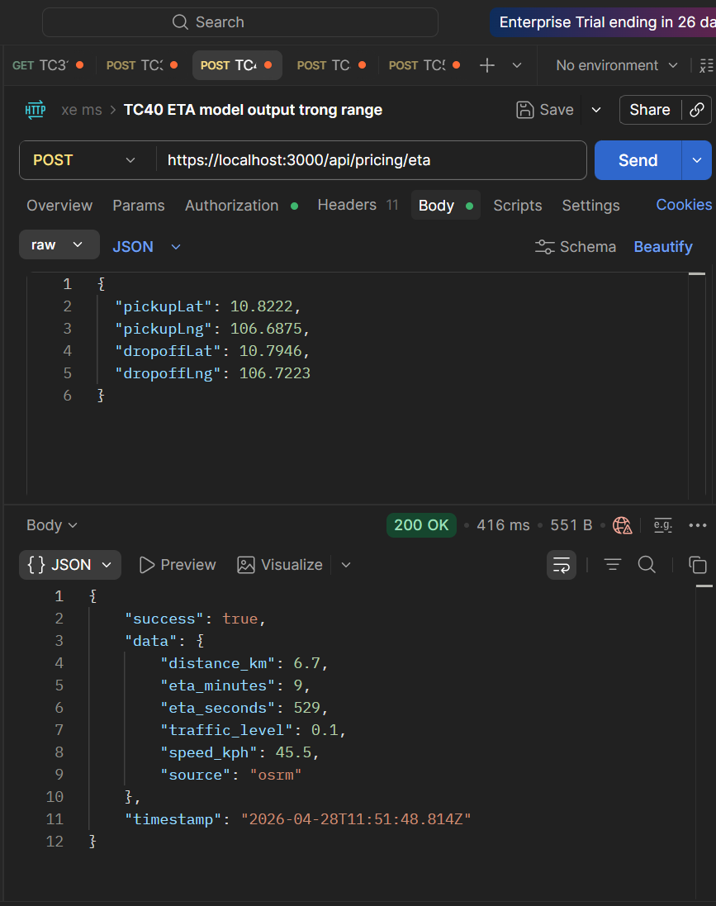
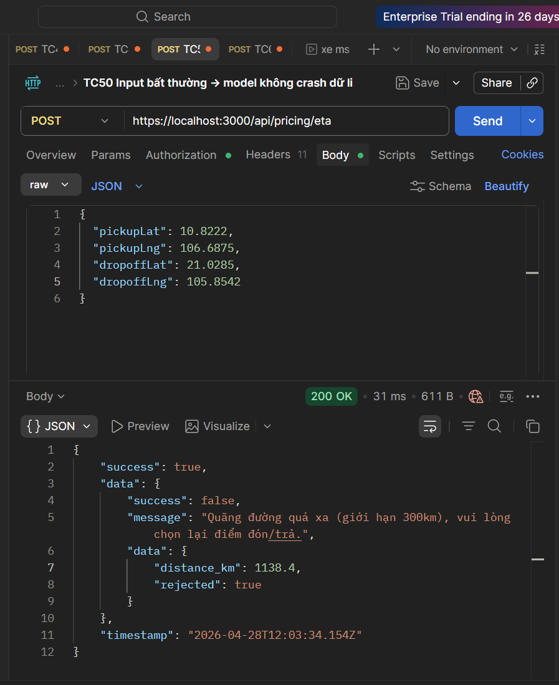
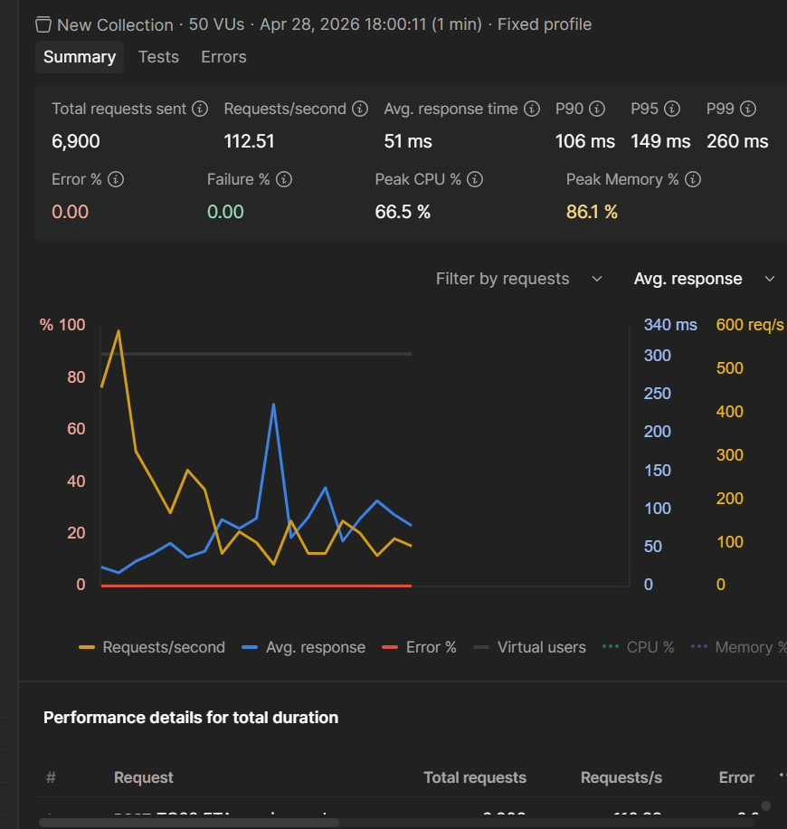

# Hướng Dẫn Kiểm Thử Phân Hệ ETA & Pricing (Postman)


## 📌 1. Chuẩn bị môi trường & Cấu hình Request chuẩn
* **Môi trường:** Đảm bảo các Docker container (PostgreSQL, Redis, RabbitMQ, Pricing Service) đang chạy.
* **Cấu hình Postman (Tránh lỗi 400 Bad Request):**
  1. Ở bất kỳ Request nào, chọn tab **Body**.
  2. Chọn kiểu **raw**.
  3. Ở ô chọn định dạng phía bên phải, bắt buộc chuyển từ `Text` thành **JSON**.


## 🧪 2. Thực thi các Test Cases

### [TC41 & TC49] Kiểm thử Tính năng ETA và Khả năng Phục hồi (Resilience)
* **Mục tiêu:** * **TC41:** Đảm bảo API trả về giá trị ETA, quãng đường hợp lý (>0).
  * **TC49:** Đảm bảo hệ thống có cơ chế Fallback (dự phòng), không bị crash khi mất kết nối Map API.
* **Method & URL:** `POST http://localhost:3000/api/pricing/eta`
* **Body (JSON):**
  ```json
  {
      "pickupLat": 10.8222,
      "pickupLng": 106.6875,
      "dropoffLat": 10.7946,
      "dropoffLng": 106.7223
  }
  ```
* **Dấu hiệu PASS:** Trả về JSON có `eta_minutes` > 0 (PASS TC41) và trường `"source": "haversine_fallback"` hoặc `"source": "google/tomtom"` (PASS TC49).

### [TC50] Kiểm thử Input bất thường (Outlier/Abnormal Input)
* **Mục tiêu:** Đảm bảo mô hình (model) không bị crash (tránh lỗi 500 Internal Server Error làm sập server) khi nhận được dữ liệu đầu vào vô lý, ví dụ: khoảng cách đón - trả quá xa vượt ngoài vùng phục vụ.
* **Method & URL:** `POST http://localhost:3000/api/pricing/eta`
* **Body (JSON) - Giả lập book xe từ TP.HCM ra Hà Nội:**
  ```json
  {
      "pickupLat": 10.8222,
      "pickupLng": 106.6875,
      "dropoffLat": 21.0285,
      "dropoffLng": 105.8542
  }
  ```
* **Dấu hiệu PASS:** Hệ thống không sập, Postman vẫn nhận được HTTP Status 200 OK nhưng bên trong JSON báo `success: false` (hoặc `rejected: true`) kèm thông báo *"Quãng đường quá xa (giới hạn 300km), vui lòng chọn lại điểm đón/trả"*. Chứng minh hệ thống bắt ngoại lệ (Exception) hoàn hảo.

### [TC62] Kiểm thử Hiệu năng & Chịu tải (ETA Service Under Load)
* **Mục tiêu:** Chứng minh hệ thống chịu được tải cao (~500 requests/sec) với Latency < 200ms và không bị timeout (0% Error) nhờ cơ chế Cache và xử lý bất đồng bộ.
* **Cách thực hiện:**
    1. Tạo một Collection mới tên `Load Test`.
    2. Kéo thả Request ETA (của TC41) vào Collection này.
    3. (Tùy chọn mô phỏng Cache Miss 100%): Dán code tạo tọa độ ngẫu nhiên vào tab **Pre-request Script** của request:
       ```javascript
        // Sinh tọa độ ngẫu nhiên dao động quanh TP.HCM
        pm.variables.set("randPickupLat", 10.7 + (Math.random() * 0.2));
        pm.variables.set("randPickupLng", 106.6 + (Math.random() * 0.2));
        pm.variables.set("randDropoffLat", 10.7 + (Math.random() * 0.2));
        pm.variables.set("randDropoffLng", 106.6 + (Math.random() * 0.2));
       ```
        ```json
            {
            "pickupLat": {{randPickupLat}},
            "pickupLng": {{randPickupLng}},
            "dropoffLat": {{randDropoffLat}},
            "dropoffLng": {{randDropoffLng}}
            }
        ```
    4. Bấm dấu `...` ở Collection `Load Test` -> Chọn **Run collection**.
    5. Chọn tab **Performance**.
    6. Cấu hình: **Virtual users (VU):** `50`, **Duration:** `1` (phút), **Load Profile:** `Fixed`.
    7. Nhấn **Run**.
* **Dấu hiệu PASS (Bằng chứng báo cáo):** Chụp biểu đồ Performance thể hiện: Đường Avg. Response < 200ms và Đường Error Rate = 0.00%.


### [TC118] Giám sát AI Service (MLOps - Model Monitoring)
* **Mục tiêu:** Thu thập bằng chứng chứng minh hệ thống có tracking và monitoring đầy đủ hoạt động của AI Model trên môi trường Production.
* **Cách thực hiện:** Chạy 1 Request gửi tọa độ lên API ETA (giống TC41) và thu thập 3 bằng chứng sau:
    1. **Log Inference Time:** Chụp thông số **Time** (VD: 26ms) ở góc phải Postman. Thể hiện thời gian AI suy luận (Inference).
    2. **Track Model Version:** Chụp trường `"source"` trong kết quả trả về (`haversine_fallback` hoặc `tomtom`). Thể hiện hệ thống đang track phiên bản model nào đưa ra dự đoán.
    3. **Monitor Drift (Input Distribution):** Chụp 2 file source code để minh chứng:
       * File `src/services/etaService.js`: Đoạn code lưu input/output vào Redis (Feature Store).
       * File `src/jobs/featureStoreSync.js`: Đoạn cronjob chạy ngầm đồng bộ dữ liệu ETA sang PostgreSQL (`historical_eta`) mỗi 15 phút để làm Data Warehouse phân tích Data Drift sau này.
```