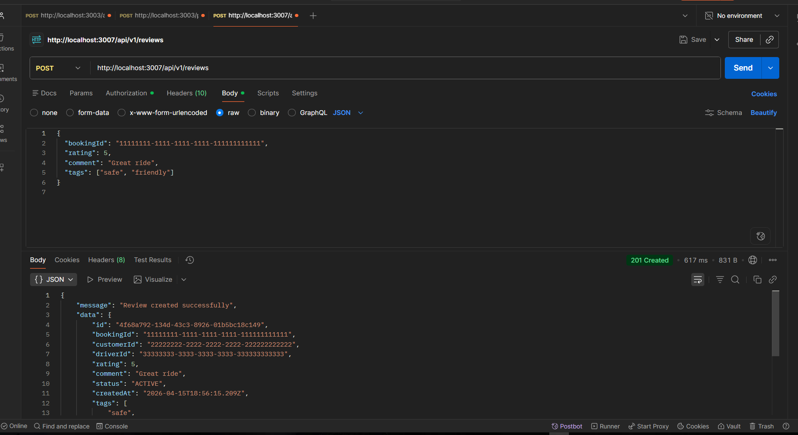
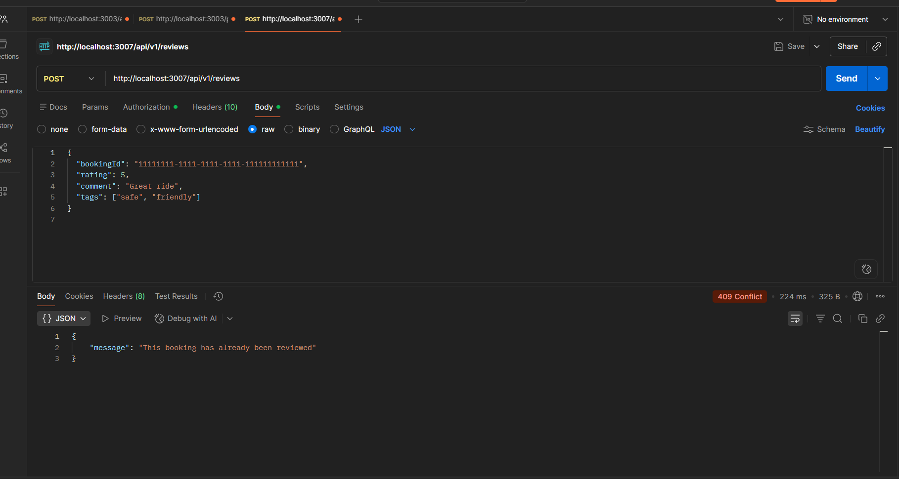
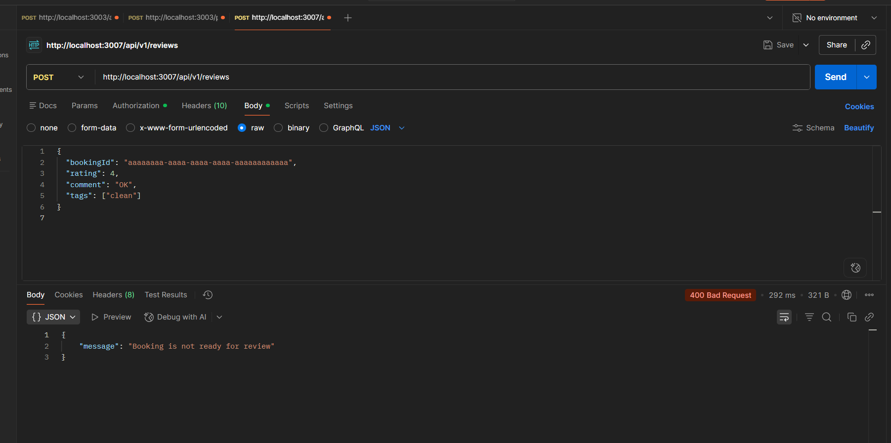

## Review Service - Test Guide

### 1. Start services

Chạy từ thư mục root project:

```bash
docker compose --env-file .env up -d --build
```

Xem log review-service:

```bash
docker compose logs -f review-service
```

Kỳ vọng có các dòng:
- `[DB] PostgreSQL connected successfully`
- `[Redis] Redis connected successfully`
- `[RabbitMQ] RabbitMQ connected successfully`
- `[PaymentConsumer] Listening for payment.completed events...`

### 2. Publish payment.completed event

Mở RabbitMQ UI: `http://localhost:15672`  
Vào Exchange `payment.events` -> Publish message:

- Routing key: `payment.completed`
- Payload:

```json
{
  "eventId": "evt-001",
  "eventType": "payment.completed",
  "timestamp": "2026-04-16T02:00:00.000Z",
  "data": {
    "bookingId": "11111111-1111-1111-1111-111111111111",
    "customerId": "22222222-2222-2222-2222-222222222222",
    "driverId": "33333333-3333-3333-3333-333333333333",
    "amount": 120000,
    "status": "COMPLETED"
  }
}
```

Kỳ vọng log:
- `[PaymentConsumer] Booking ... marked as READY_FOR_REVIEW`

### 3. Test API on Postman

Endpoint:
- `POST http://localhost:3007/api/v1/reviews`

Headers:
- `Content-Type: application/json`
- `x-customer-id: 22222222-2222-2222-2222-222222222222`

#### Case A - Success (201)

Body:

```json
{
  "bookingId": "11111111-1111-1111-1111-111111111111",
  "rating": 5,
  "comment": "Great ride",
  "tags": ["safe", "friendly"]
}
```

Expected: `201 Created`

#### Case B - Duplicate booking review (409)

Gửi lại cùng body của Case A.

Expected: `409 Conflict`

#### Case C - Booking not ready (400)

Body:

```json
{
  "bookingId": "aaaaaaaa-aaaa-aaaa-aaaa-aaaaaaaaaaaa",
  "rating": 4,
  "comment": "OK",
  "tags": ["clean"]
}
```

Expected: `400 Bad Request` (`Booking is not ready for review`)
