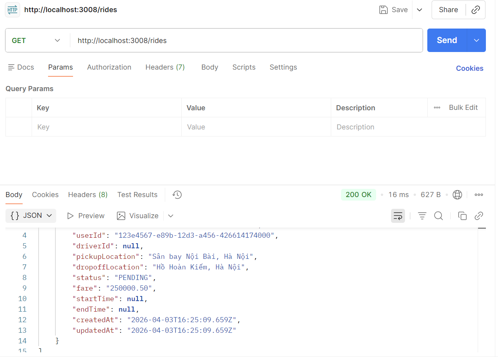
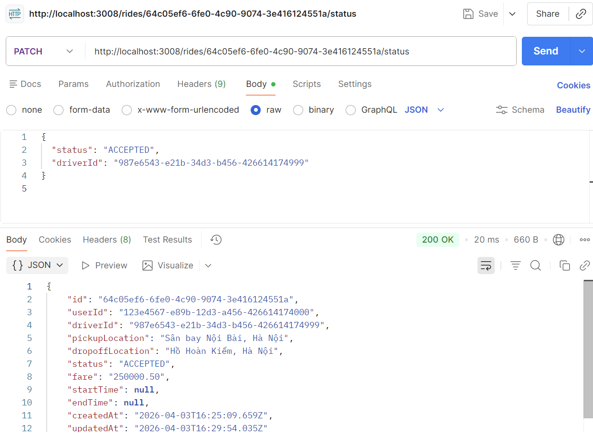
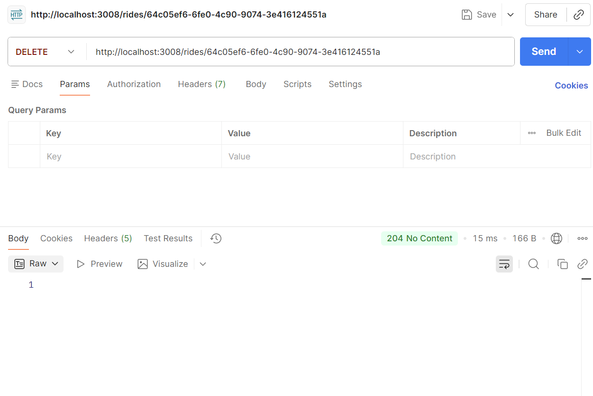

# Ride Service 🚗

Đây là dịch vụ quản lý chuyến đi (Ride) của hệ thống Cab Booking, sử dụng PostgreSQL và RabbitMQ.

### 1. Tạo chuyến đi mới

- **Method**: `POST`
- **URL**: `http://localhost:3008/rides`

### 2. Xem danh sách tất cả chuyến đi

- **Method**: `GET`
- **URL**: `http://localhost:3008/rides`

### 3. Cập nhật trạng thái chuyến đi

- **Method**: `PATCH`
- **URL**: `http://localhost:3008/rides/{YOUR-RIDE-ID}/status`

### 4. Xóa chuyến đi

- **Method**: `DELETE`
- **URL**: `http://localhost:3008/rides/{YOUR-RIDE-ID}`
  _*(thay `{YOUR-RIDE-ID}` bằng ID ở bước 1)*_
