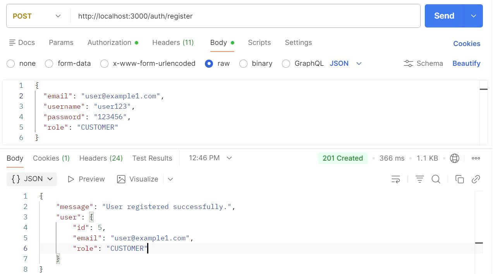
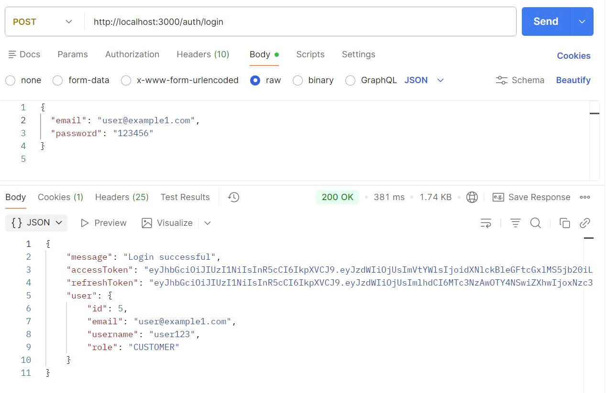
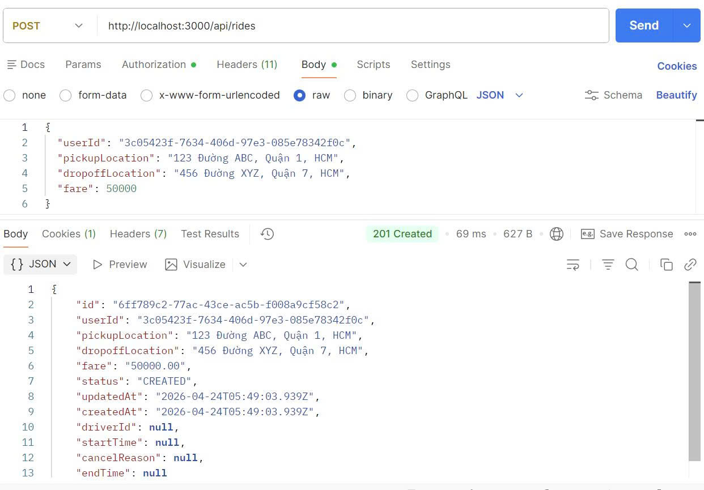
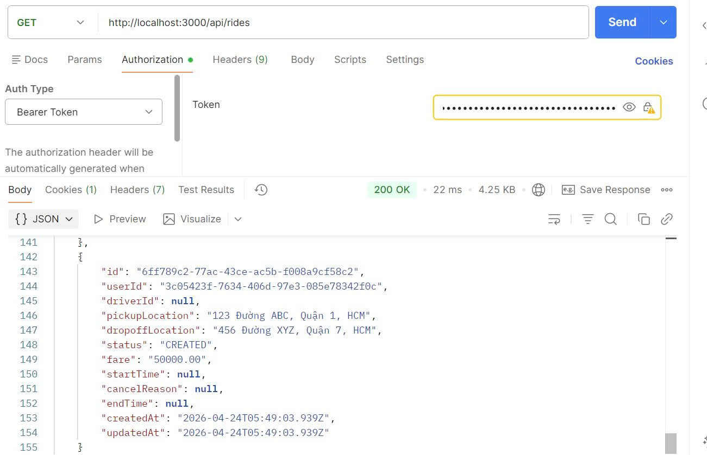
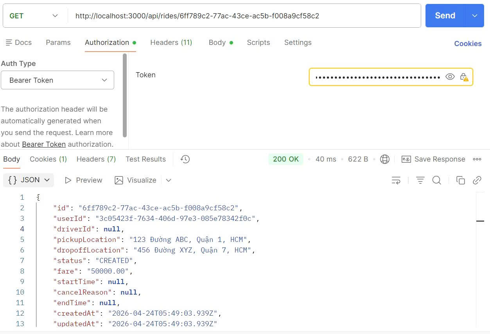
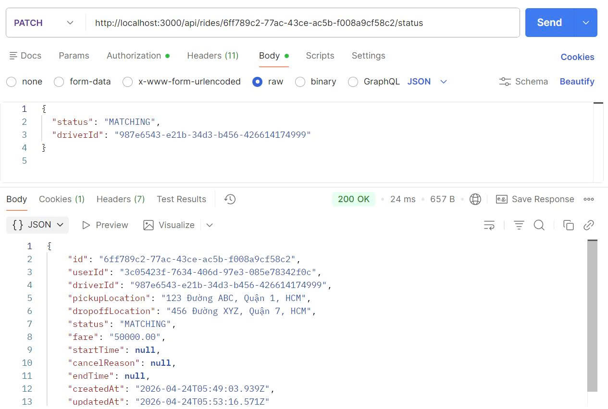
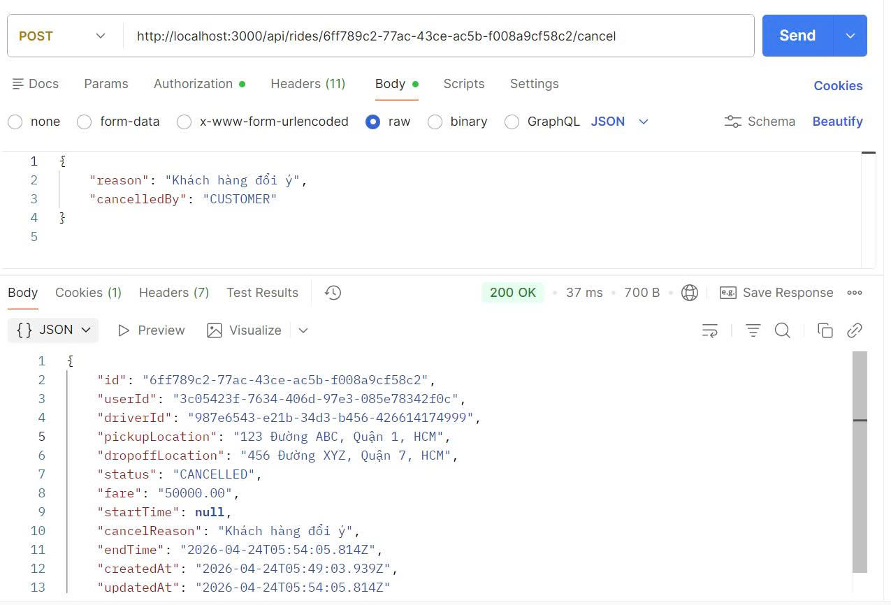
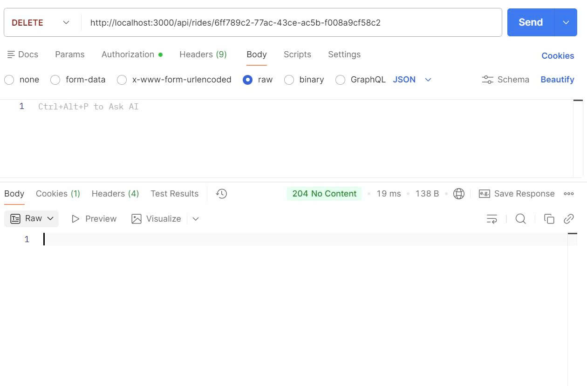

# Ride Service 🚗

Đây là dịch vụ quản lý chuyến đi (Ride) của hệ thống Cab Booking, chạy qua **API Gateway (Port 3000)**.

### 1. Đăng ký tài khoản
- **Method**: `POST`
- **URL**: `http://localhost:3000/auth/register`

{
  "email": "user@example.com",
  "username": "user123",
  "password": "Password123",
  "role": "CUSTOMER"
}

### 2. Đăng nhập để lấy access token
- **Method**: `POST`
- **URL**: `http://localhost:3000/auth/login`

{
  "email": "user@example1.com",
  "password": "123456"
}

### 3. Tạo chuyến đi mới
- **Method**: `POST`
- **URL**: `http://localhost:3000/api/rides`

{
  "userId": "3c05423f-7634-406d-97e3-085e78342f0c",
  "pickupLocation": "123 Đường ABC, Quận 1, HCM",
  "dropoffLocation": "456 Đường XYZ, Quận 7, HCM",
  "fare": 50000
}

### 4. Xem danh sách tất cả chuyến đi
- **Method**: `GET`
- **URL**: `http://localhost:3000/api/rides`

### 5. Lấy chi tiết một chuyến đi
- **Method**: `GET`
- **URL**: `http://localhost:3000/api/rides/{YOUR-RIDE-ID}`

### 6. Cập nhật trạng thái chuyến đi
- **Method**: `PATCH`
- **URL**: `http://localhost:3000/api/rides/{YOUR-RIDE-ID}/status`

{
  "status": "MATCHING",
  "driverId": "987e6543-e21b-34d3-b456-426614174999"
}

### 7. Hủy chuyến đi
- **Method**: `POST`
- **URL**: `http://localhost:3000/api/rides/{YOUR-RIDE-ID}/cancel`

{
    "reason": "Khách hàng đổi ý",
    "cancelledBy": "CUSTOMER"
}

### 8. Xóa chuyến đi
- **Method**: `DELETE`
- **URL**: `http://localhost:3000/api/rides/{YOUR-RIDE-ID}`

