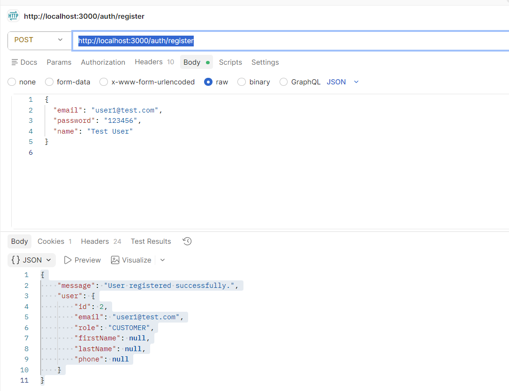

1. Đăng ký user thành công
POST
http://localhost:3000/auth/register
{
  "email": "user1@test.com",
  "password": "123456",
  "name": "Test User"
}

kết quả:
{
    "message": "User registered successfully.",
    "user": {
        "id": 2,
        "email": "user1@test.com",
        "role": "CUSTOMER",
        "firstName": null,
        "lastName": null,
        "phone": null
    }
}

2. Đăng nhập trả JWT hợp lệ
POST
